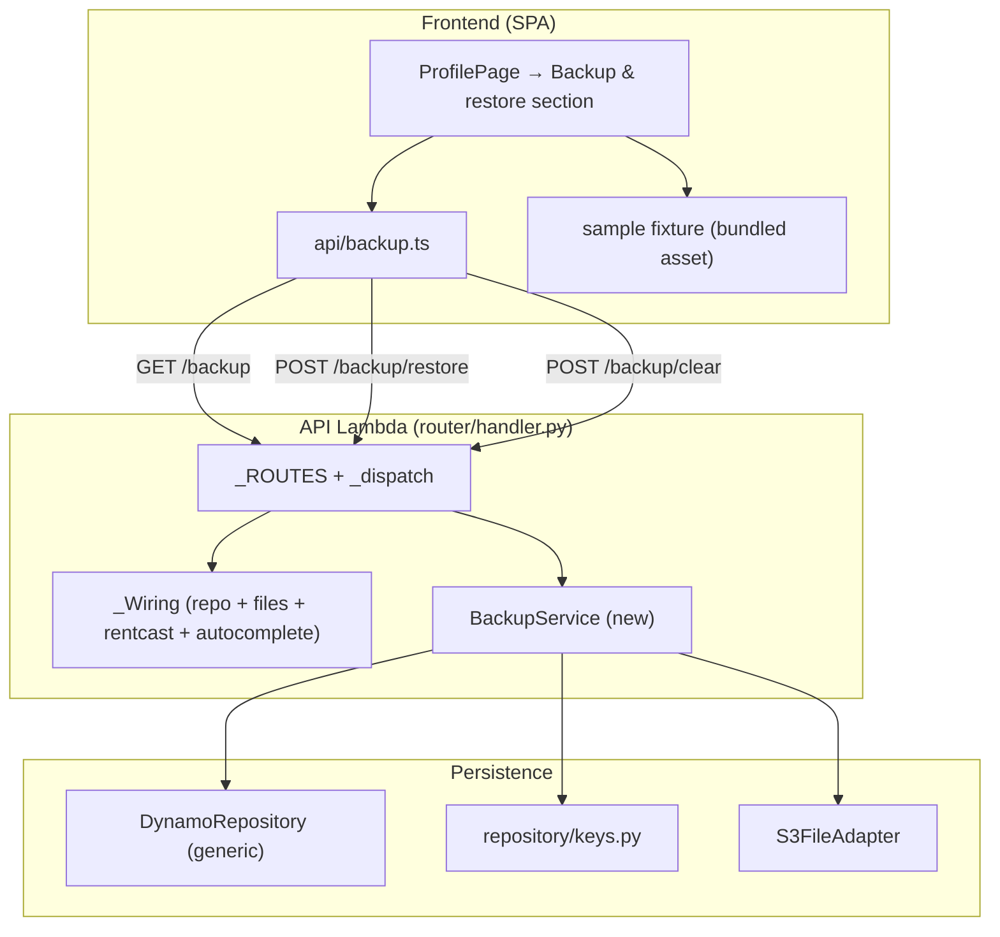

# Design Document

## Overview

This feature adds four user-initiated data-portability capabilities to Logstead — **Export**, **Restore**, **Clear**, and **Load Sample Data** — layered onto the existing single-Lambda / single-DynamoDB-table architecture without introducing any new infrastructure.

The design's guiding principle is **reuse the existing key scheme and item shapes rather than inventing new ones.** Logstead's persistence layer is already the single source of truth for how each entity is keyed (`backend/src/logstead/repository/keys.py`) and how each entity serializes to a DynamoDB item (each service's private `_to_item` / `_to_rows` helper). A backup must produce data that is byte-for-byte compatible with what the normal CRUD services write, so that a restored dataset behaves identically to a hand-entered one. The one place the existing services *cannot* be reused directly is the write path: every `create()` method generates a **new** `uuid` and stamps **fresh** `created_at`/`updated_at`, and none of them accept a caller-supplied id. Restore must preserve the original id and timestamps, so it writes item dicts **directly** through the generic repository (`put_item` / `transact_write`) using the shared key builders — never through `create()`.

Three architectural facts from the existing codebase shape the whole design:

1. **The repository is generic.** `DynamoRepository` exposes only `put_item`, `get_item`, `query`, `delete_item`, and `transact_write` (a `TransactWriteItems` wrapper, capped by DynamoDB at 100 actions per call). It already enforces the money contract (money attributes stored as two-decimal strings, parsed back to `Decimal`) and sparse writes (drops `None`). Backup/restore/clear are expressed entirely in terms of these five primitives plus the key builders.

2. **All of a property's children live in one partition.** `PK=PROPERTY#<id>` holds `META`, `DETAILS`, `NOTE`, `USAGE#<year>`, `PHOTO#<id>`, `TXN#<invDate>#<txnId>`, receipt `TXN#…#DOC#<docId>`, `ASSET#<id>`, and `ASSET#<id>#SCHED#<year>` rows. The user partition `USER#<sub>` holds the property list rows (`SK=PROP#<id>`) and `PROFILE`. This means export reads and clear deletes are a small number of `query` calls per property.

3. **Money is exact strings end-to-end.** Money is `Decimal` in code, two-decimal strings in DynamoDB and in JSON responses (the router's `_to_jsonable` renders every `Decimal` as `str(Decimal)`). The Backup_Document reuses this exact convention, and `details_to_dict` / `details_from_dict` already round-trip the `PropertyDetails` tree with exact money and full-precision coordinate strings.

On the backend, the feature adds one new service (`BackupService`), three new routes wired into the existing `_ROUTES` table, and no new table, index, or bucket. On the frontend, it adds one API module (`api/backup.ts`) and a **Backup & restore** section on the existing `ProfilePage`, built entirely from the shared UI primitives (`Button`, `ConfirmDialog`, `Card`, `StateBlock`, `useToast`) and the client-side download pattern already used by `ReportsPage`. A committed sample fixture ships as a bundled asset.

### Requirements → design-section map

| Requirement | Design section |
|---|---|
| 1 (Export) | Components → BackupService.export; Data Models → Backup_Document; Export read path |
| 2 (Restore replace-all, preserved ids) | Components → BackupService.restore; The id/timestamp-preserving write path |
| 3 (Validate before mutate) | Components → Validation model; Error Handling |
| 4 (Category integrity) | Components → Validation model (category check) |
| 5 (Schema version) | Components → Validation model (version check); Data Models → Schema_Version |
| 6 (Restore confirmation) | Frontend → Restore flow |
| 7 (Clear deletes all) | Components → BackupService.clear; Clear deletion order |
| 8 (Clear removes S3 + safe ordering) | Components → BackupService.clear; S3 purge |
| 9 (Clear confirmation) | Frontend → Clear flow |
| 10 (Sample data) | Frontend → Load-sample flow; Sample fixture |
| 11 (User scoping) | Components → user scoping; Route wiring |
| 12 (Consistency / batching) | Components → Batching and the consistency story |
| 13 (Money exactness) | Data Models → money handling; Correctness Properties |
| Non-Goals | Non-Goals (reaffirmed) |

## Architecture

Nothing new is deployed. The feature reuses the single Lambda + API Gateway HTTP API, the single DynamoDB table, and the single S3 bucket.



`BackupService` sits alongside the other services. It composes the generic `DynamoRepository`, the `S3FileAdapter` (needed by clear and by restore's clear-first step), and the authenticated user id. It reuses the existing per-entity services for the **read** path (they already return typed model objects) but writes through the repository directly for the **restore** path (to preserve ids/timestamps).

### Request flow

- **Export** — `GET /backup` → `BackupService.export()` returns a `Backup_Document` value; the router serializes it to JSON (money as strings via the existing `_to_jsonable`); the browser saves it as a file.
- **Restore** — `POST /backup/restore` with the parsed document as the JSON body → `BackupService.restore(document)` validates fully, then clears, then writes in batches → returns a summary `Result`.
- **Clear** — `POST /backup/clear` → `BackupService.clear()` purges S3 then deletes rows → returns a summary `Result`.

## Components and Interfaces

### BackupService (new) — `backend/src/logstead/services/backup.py`

`BackupService` owns export, restore, and clear. It is constructed per request from the shared wiring with the repository, the S3 files adapter, and the authenticated user (mirroring how `PropertyService` takes `repo` + `user`).

```python
class BackupService:
    def __init__(self, repo: DynamoRepository, files: S3FileAdapter, user: UserContext | str) -> None: ...

    # Requirement 1, 11, 13 — read + serialize everything the user owns.
    def export(self) -> BackupDocument: ...

    # Requirements 2, 3, 4, 5, 11, 12, 13 — validate → clear → write (batched).
    def restore(self, raw_document: Any) -> Result[RestoreSummary]: ...

    # Requirements 7, 8, 11 — purge S3 then delete all rows (batched, bottom-up).
    def clear(self) -> Result[ClearSummary]: ...
```

`RestoreSummary` / `ClearSummary` are small frozen dataclasses carrying counts (properties, transactions, assets, usage years) plus, for clear, a list of S3 keys whose deletion failed (Requirement 8.4). They serialize cleanly through the router.

The service builds keys **only** through `repository/keys.py` and reuses money handling by passing the same `money_attrs` the CRUD services use (e.g. `{"costBasis"}` for assets, defaults for transactions). It reuses `details_to_dict` / `details_from_dict` for the details subtree and `compute_schedule_rows` (the pure function) to rematerialize schedules on restore.

#### Reusing the item-mapping helpers

The transaction, asset, photo, property, and details serializers each already produce the exact item shapes DynamoDB expects (`_to_item`, `_to_rows`, `_document_to_item`, `_schedule_row_item`, `details_to_json`). Restore needs those same shapes but with a caller-supplied id and timestamps. The design **promotes the pure mapping functions to module-level, importable helpers** where they are not already (transaction `_to_item` and `_document_to_item` are already module-level; the property `_to_rows` and the asset `_to_item` / `_schedule_row_item` are instance methods that do not depend on instance state beyond `user_id`). `BackupService` reuses them by:

- **Property list row + META mirror + GSI1 keys**: build a `Property` dataclass from the document (with the document's id/timestamps and the authenticated `user_id`) and reuse the property row builder, which already emits both rows with identical GSI1 keys.
- **Details row**: reuse `details_from_dict(doc_subtree)` → `details_to_json(details)` and write the `PROPERTY#<id> / DETAILS` row shape (`userId`, `propertyId`, `detailsJson`).
- **Note row**: write the `PROPERTY#<id> / NOTE` row shape (`propertyId`, `userId`, `text`, `updatedAt`).
- **Usage rows**: write `PROPERTY#<id> / USAGE#<year>` shape (`propertyId`, `taxYear`, `fairRentalDays`, `personalUseDays`).
- **Transaction row**: build a `Transaction` dataclass with the document's id/timestamps and reuse transaction `_to_item(txn, parsed_date)`, which emits the base SK **and** the GSI2 tax-year keys. The `schedule_e_line` is re-resolved from the category catalog by `category_id` (never trusted from the document), keeping Line values consistent with the current catalog.
- **Asset row + schedule rows**: build a `DepreciableAsset` with the document's id/timestamps, reuse the asset `_to_item` (passing `money_attrs={"costBasis"}`), then compute `compute_schedule_rows(asset)` and reuse the schedule-row builder for each row (with its GSI2 tax-year keys). Schedule rows are **not** read from the document (Requirement 10 Non-Goal / 2.5) — they are always recomputed.

This keeps a single source of truth for item shapes: if a CRUD service's item shape ever changes, restore inherits the change because it calls the same builder.

#### Export read path (Requirement 1, 11)

There is no "list all rows" primitive, and `get_usage_days` is per-year only. Export therefore drives off the user's owned-property list and reads each property's children by prefix query:

1. `PropertyService.list()` → the owned `Property` list (Requirement 11.3: the property set is derived from the user's owned list; ownership is implicit because the list lives under `USER#<sub>`).
2. For each property (ownership already established):
   - `PropertyService.get(id)` → property fields **+** attached `details` (its `get` already reads and attaches the DETAILS row).
   - `PropertyService.get_note(id)` → note text (empty string when none).
   - **Usage years**: a raw `repo.query(property_scoped_pk(id), sk_begins_with=USAGE_PREFIX)` — a small new read that returns *all* usage rows (the per-year `get_usage_days` is insufficient). This raw query is encapsulated inside `BackupService` (a private `_list_usage(property_id)`), not added to `PropertyService`, to keep the change scoped to this feature.
   - `TransactionService.list_for_property(id)` → all transactions (the `#DOC#` receipt rows are already filtered out).
   - `DepreciationService.list_assets(id)` → all assets (schedule rows filtered out).
3. Assemble the `Backup_Document` with money as strings and the details subtree via `details_to_dict`.

Photos, receipts, import sessions, and schedule rows are **never read** into the document (Requirements 1.9, 1.10). The category catalog is never embedded (1.8); transactions carry only their `category_id` slug.

#### The id/timestamp-preserving write path (Requirement 2)

Restore constructs item dicts directly and writes them via `put_item` / `transact_write`. For each property in the document, the write set is:

| Entity | Row(s) written | Keys | Money attrs |
|---|---|---|---|
| Property | list row + META mirror | `USER#<sub>/PROP#<id>`, `PROPERTY#<id>/META`, both with `GSI1PK/SK` | — |
| Details (if present) | DETAILS row | `PROPERTY#<id>/DETAILS` (`detailsJson`) | — (money inside JSON) |
| Note (if present) | NOTE row | `PROPERTY#<id>/NOTE` | — |
| Usage year (each) | USAGE row | `PROPERTY#<id>/USAGE#<year>` | — |
| Transaction (each) | TXN row | `PROPERTY#<id>/TXN#<invDate>#<txnId>` + `GSI2PK/SK` | default (`amount`) |
| Asset (each) | ASSET row | `PROPERTY#<id>/ASSET#<id>` | `{costBasis}` |
| Schedule row (recomputed, each) | SCHED row | `PROPERTY#<id>/ASSET#<id>#SCHED#<year>` + `GSI2PK/SK` | `{amount, remainingBasis}` |

Because `money_attrs` differs per entity (assets narrow to `costBasis`; schedule rows use `{amount, remainingBasis}`; the recovery period is a plain `Decimal` string, never money), restore groups writes by their money-attr set and issues a `transact_write` per group per batch, rather than mixing entities with conflicting money contracts in one call.

Ids and timestamps come **from the document**, never generated. `created_at`/`updated_at` are written verbatim. This is the crux of Requirement 2.2/2.3 and is what the normal `create()` path cannot do.

#### Validation model (Requirements 3, 4, 5) — validate fully before any mutation

Restore runs a **pure, side-effect-free validation pass** over the raw parsed document *before* touching the store. Validation lives in a module-level function `validate_document(raw) -> Result[BackupDocument]` so it is unit-testable in isolation and so `restore` can guarantee "no read/write happens until validation passes."

Validation order and rules:

1. **JSON object shape** (3.1): the body must be a JSON object with a `properties` array; a non-object or missing/mistyped top-level structure → `validation` error.
2. **Schema version** (5.1, 5.2, 5.3): `schema_version` must be present (else 5.1 error) and equal to the single supported constant `SCHEMA_VERSION = "1"` (else a `validation` error naming the unsupported version, 5.2). Only a supported version proceeds (5.3).
3. **Per-entity required fields** (3.2): each property requires `id`, `name`, `address_text`; each transaction requires `id`, `property_id`, `date`, `amount`, `type`, `category_id`; each asset requires `id`, `property_id`, `description`, `cost_basis`, `placed_in_service_date`. A missing field → `validation` error whose message identifies the entity (by type + id) and the field.
4. **Money format** (3.4, 13.2): every money value (transaction `amount`, asset `cost_basis`, and every money field inside the details subtree) must be a valid two-decimal string; parsing uses `to_money` (exact `Decimal`, never float). A bad value → `validation` error naming the offending value and its location. Coordinates are validated as parseable full-precision decimals.
5. **Category integrity** (4.1, 4.2, 4.3): every transaction `category_id` must be present (4.2) and must be a member of `CATEGORY_CATALOG` (indexed by id, as `transaction.category_by_id` already does). An unknown id → `validation` error naming it (4.1). The **whole document is rejected** on any bad category, so no transaction is silently dropped or reassigned (4.3).
6. **Cross-reference sanity**: each child's `property_id` must match a property present in the document (supports 2.4's guarantee that children resolve to their original property).

Validation returns a fully-parsed, typed `BackupDocument` (money already `Decimal`) on success. Only then does `restore` proceed to clear + write. If validation fails, `restore` returns the `validation` `Result` **without any read or write** (3.1, 3.2, 3.4, 4.1, 5.1, 5.2 all include "SHALL NOT delete or modify any existing data").

#### Clear deletion order and S3 purge (Requirements 7, 8)

`clear()` (also the first phase of `restore`) removes everything the user owns, S3 binaries first, then rows, bottom-up:

1. Enumerate the user's properties via `PropertyService.list()`.
2. For each property partition, `query` the child rows once and bucket them:
   - Receipt rows (`TXN#…#DOC#` — SK contains `#DOC#`) → collect `s3Key`.
   - Photo rows (`PHOTO#` prefix) → collect `s3Key`.
   - All other rows (META, DETAILS, NOTE, USAGE, TXN, ASSET, SCHED) → collect for deletion.
3. **S3 purge first** (8.1, 8.2, 8.3): for every collected `s3Key`, call `files.delete_object(key)`. S3 delete is idempotent. Each S3 delete is wrapped in a try/except: on failure, record the key in the summary and **continue** (8.4) — a single failed object never aborts the clear.
4. **Row deletes, bottom-up and batched** (8.5, 12.3): delete children (TXN, receipt DOC rows, ASSET, SCHED, PHOTO, DETAILS, NOTE, USAGE) before the property's META mirror and `USER#/PROP#` list row, so nothing references a still-present parent mid-delete. Deletes are chunked into `transact_write` calls of ≤ 100 actions (the DynamoDB cap).

Because the metadata row is deleted **after** its S3 object, a crash between the two leaves at worst an orphaned metadata row pointing at an already-deleted (idempotent) key — never an orphaned S3 object, which is exactly the ordering Requirement 8.3 demands.

#### Batching and the consistency story (Requirement 12)

DynamoDB `TransactWriteItems` caps at 100 actions, so a realistic dataset (many transactions/assets/schedule rows) exceeds one transaction. True all-or-nothing across batches is **not possible** with DynamoDB. The design adopts the pragmatic guarantee the requirement asks for:

- **Validate fully first** (3.3) — a malformed document never begins a clear, so a bad upload can never half-wipe data.
- **Then clear, then write in batches** (2.1, 12.3) — each batch is an atomic `transact_write`.
- **On success**, the store equals the document with no leftovers (12.1) — guaranteed because clear removed everything first and every document entity is written.
- **On mid-write failure** (12.2), `restore` catches the repository error and returns a `Result` error (kind `conflict` or a dedicated message) stating the restore did not complete and the user should retry. Retrying is safe: restore re-clears then re-writes, so a partial write from a failed attempt is wiped by the next attempt's clear. The design does **not** claim atomicity across batches; it claims *validate-then-replace with a clear retry signal*.

### Route surface + wiring (Requirements 6, 9, 11) — `router/handler.py`

Three routes are added to `_ROUTES` (all protected; no public route):

```
("GET",  "/backup",         _export_backup,  False),
("POST", "/backup/restore", _restore_backup, False),
("POST", "/backup/clear",   _clear_backup,   False),
```

Route placement: these are static paths with a distinct prefix (`/backup`), so ordering relative to `/properties/...` is irrelevant to matching.

A `_backup_service(wiring, user)` constructor is added next to the existing `_property_service` etc. It needs the S3 adapter for clear/restore, so it uses the existing `_require_files(wiring)` helper — a request that reaches restore/clear when the bucket is unconfigured surfaces the standard **503** ("File storage is not configured"), consistent with photo/receipt routes.

Handlers are thin, matching the existing pattern:

- `_export_backup` → `_response(200, service.export())` (the router's `_to_jsonable` renders money as strings; the `BackupDocument` is a dataclass so it serializes field-by-field).
- `_restore_backup` → `_result_response(service.restore(body))`. The router already rejects a non-object body with 400 (`_parse_body`), and `_result_response` maps a `validation` `Result` to **400** — exactly Requirement 3/4/5's "reject with a validation error." A mid-restore failure maps to its `Result` kind (409/500-style message).
- `_clear_backup` → `_result_response(service.clear())`.

**User scoping** (Requirement 11): every handler resolves `user = current_user(event)` (all three routes are `public=False`), and `BackupService` scopes all keys to `user_id`. No route accepts a user parameter, and there is no cross-user surface (11.4).

### Frontend (Requirements 1.12, 6, 9, 10)

#### `frontend/src/api/backup.ts` (new)

Mirrors the existing feature-scoped API module pattern (`properties.ts`): a module-level `ApiClient` singleton with test injection, typed functions, and a `BackupDocument` interface whose money fields are **strings** (never coerced to `number`).

```typescript
export interface BackupDocument {
  schema_version: string;
  exported_at: string;
  properties: BackupProperty[];
}
// BackupProperty nests details/note/usage/transactions/assets;
// all money and coordinate fields typed as string.

export function fetchBackup(signal?): Promise<BackupDocument>;      // GET /backup
export function restoreBackup(doc: BackupDocument, signal?): Promise<RestoreSummary>; // POST /backup/restore
export function clearData(signal?): Promise<ClearSummary>;          // POST /backup/clear
```

#### UI placement — a section on `ProfilePage`

`ProfilePage` (`Profile & settings`, already routed at `/profile`) is the natural home; it already hosts an **Account** and **Integrations** section. The design adds a **Backup & restore** `<section>` (using the shared `Card` for grouping and `StateBlock` for pending/empty/error states) with four actions built from the shared `Button` + `ConfirmDialog` + `useToast`:

1. **Download backup** — calls `fetchBackup()`, then triggers a client-side file download reusing the exact Blob + object-URL mechanism `ReportsPage` uses (`downloadFile(content, filename, mimeType)`), with filename `logstead-backup-<date>.json` and MIME `application/json`. On error, a toast.

2. **Restore from file** — a hidden `<input type="file" accept="application/json">`; on selection the file text is read and `JSON.parse`d client-side (a parse failure shows a toast and does not proceed). A `ConfirmDialog` (destructive) then explains restore replaces all current data (Requirement 6.1). On confirm → `restoreBackup(parsed)`; success/failure toast. Cancel closes the dialog and makes no request (6.2). Server-side validation errors (400) surface their message in the toast.

3. **Clear all data** — a destructive `ConfirmDialog` (Requirement 9.1) → on confirm `clearData()`; success/failure toast. Cancel makes no request (9.2).

4. **Load sample data** — fetches the bundled sample fixture, then runs the **same** restore confirm flow (Requirement 10.5, 10.6): a `ConfirmDialog` → `restoreBackup(fixture)` → toast. It reuses the restore path exactly, so the fixture is validated by the same server-side validator.

Money stays a string throughout the client (the `BackupDocument` type enforces it). The confirm dialogs reuse `ConfirmDialog`'s existing danger styling and pending state.

#### Sample fixture location (Requirement 10)

The fixture ships as a **bundled importable asset** at `frontend/src/data/sample-backup.json` and is imported directly (`import sampleBackup from "../data/sample-backup.json"`). Bundling (rather than `public/` runtime fetch) means the fixture is type-checked against `BackupDocument` at build time and can be asserted valid by a unit test, guarding against fixture rot. It is a valid `Backup_Document` the restore path accepts: `schema_version: "1"`, exactly 2 properties, 5 tax years of income + expense transactions across multiple categories (`rents-received`, `repairs`, `insurance`, `taxes`, `utilities`, `management-fees`, …), ≥ 1 asset per property, preserved-id-shaped `id`s (uuids), valid `category_id` slugs from `CATEGORY_CATALOG`, and all amounts as two-decimal strings.

## Data Models

### Backup_Document (versioned JSON)

Field names use the backend's **snake_case** convention (the router serializes dataclass fields verbatim, and the SPA already consumes snake_case). Money and coordinates are strings.

```json
{
  "schema_version": "1",
  "exported_at": "2025-02-14T10:30:00+00:00",
  "properties": [
    {
      "id": "7b1c…-uuid",
      "name": "Maple Street Duplex",
      "address_text": "123 Maple St, Springfield, IL 62704",
      "property_type": "single_family",
      "created_at": "2023-01-05T12:00:00+00:00",
      "updated_at": "2024-11-02T09:15:00+00:00",
      "details": {
        "formatted_address": "123 Maple St, Springfield, IL 62704",
        "latitude": "39.781721",
        "longitude": "-89.650148",
        "year_built": 1998,
        "last_sale_price": "245000.00",
        "tax_assessments": [{ "year": 2023, "value": "230000.00" }]
      },
      "note": "Tenant lease renews each August.",
      "usage": [
        { "tax_year": 2023, "fair_rental_days": 300, "personal_use_days": 0 },
        { "tax_year": 2024, "fair_rental_days": 365, "personal_use_days": 0 }
      ],
      "transactions": [
        {
          "id": "a2f0…-uuid",
          "property_id": "7b1c…-uuid",
          "date": "2024-03-01",
          "amount": "1850.00",
          "type": "income",
          "category_id": "rents-received",
          "description": null,
          "created_at": "2024-03-01T08:00:00+00:00",
          "updated_at": "2024-03-01T08:00:00+00:00"
        }
      ],
      "assets": [
        {
          "id": "c9d3…-uuid",
          "property_id": "7b1c…-uuid",
          "description": "HVAC system",
          "cost_basis": "8000.00",
          "placed_in_service_date": "2023-06-15",
          "recovery_period_years": "27.5",
          "created_at": "2023-06-15T10:00:00+00:00",
          "updated_at": "2023-06-15T10:00:00+00:00"
        }
      ]
    }
  ]
}
```

Notes on the shape:

- **`schema_version`** (Requirement 1.11, 5): the single supported value is `"1"`. It is validated on restore.
- **`exported_at`**: informational ISO-8601 timestamp; not used for restore decisions.
- **`details`** is exactly the output of `details_to_dict` (sparse; money as two-decimal strings; `latitude`/`longitude` as full-precision decimal strings). Restore parses it back with `details_from_dict`. Absent when the property has no stored details.
- **`note`** is a plain string, present only when set.
- **`usage`**, **`transactions`**, **`assets`** are arrays; empty arrays are permitted and simply produce no child writes.
- **`schedule_e_line`** is **not** stored in the document — it is re-derived from `category_id` on restore, so the document stays decoupled from Schedule E line assignments.
- **Schedule rows** are **not** in the document (recomputed on restore; 2.5, Non-Goal).
- **Photos, receipts, import sessions, PDF drafts, the category catalog** are **not** in the document (1.8, 1.9).

### Storage mapping on restore (per entity)

The document maps to the existing single-table item shapes exactly as the CRUD services would write them, except id and timestamps come from the document. See "The id/timestamp-preserving write path" table above for the row set and key/money-attr choices per entity. Because the shapes are identical to normal writes, a restored dataset is indistinguishable from a hand-entered one and behaves identically under every existing read path (listing, tax-year GSI2 queries, reports).

### Summaries (service return values)

```python
@dataclass(frozen=True)
class RestoreSummary:
    properties: int
    transactions: int
    assets: int
    usage_years: int

@dataclass(frozen=True)
class ClearSummary:
    properties: int
    transactions: int
    assets: int
    photos: int
    receipts: int
    failed_s3_keys: list[str]  # Requirement 8.4: best-effort S3 delete failures
```

## Correctness Properties

*A property is a characteristic or behavior that should hold true across all valid executions of a system — essentially, a formal statement about what the system should do. Properties serve as the bridge between human-readable specifications and machine-verifiable correctness guarantees.*

Property-based testing applies well here: export/restore/clear are data transformations over an arbitrarily large input space (arbitrary sets of properties, transactions, assets, usage years, details trees, money values), with strong universal invariants (round-trip identity, replace-all, no-mutation-on-invalid). The backend already uses **Hypothesis** and the frontend **fast-check**; these properties are written for that style.

### Property 1: Backup round-trip preserves ids, timestamps, money, coordinates, and structure

*For any* valid dataset owned by a user, exporting to a Backup_Document, restoring that document, and re-exporting produces a document equivalent to the first (after canonical ordering): every property, transaction, asset, usage year, note, and details subtree has an identical `id`, identical `created_at`/`updated_at`, identical `property_id` cross-references, and money and coordinate values that are string-identical.

**Validates: Requirements 1.2, 1.3, 1.4, 1.5, 1.6, 1.7, 2.2, 2.3, 2.4, 13.1, 13.2, 13.3, 13.4**

### Property 2: Restore is replace-all with no leftovers

*For any* pre-existing dataset A and any valid Backup_Document B, restoring B results in stored data equal to B, with none of A's records that are absent from B remaining.

**Validates: Requirements 2.1, 12.1**

### Property 3: An invalid document is rejected without mutating the store

*For any* pre-existing dataset and any Backup_Document made invalid in exactly one way (non-object structure, a dropped required field, a malformed money string, a `category_id` outside the catalog, a missing or unsupported schema version), restore returns a validation error that identifies the offending entity/field/value/version, and the stored data is byte-for-byte unchanged.

**Validates: Requirements 3.1, 3.2, 3.3, 3.4, 4.1, 5.1, 5.2**

### Property 4: Restore recomputes each asset's depreciation schedule

*For any* valid Backup_Document, after a successful restore every restored asset's materialized schedule rows equal `compute_schedule_rows(restored_asset)`, and no schedule rows are read from the document.

**Validates: Requirements 2.5**

### Property 5: Clear empties the user's store

*For any* dataset owned by a user, after clear the user has no remaining property, transaction, asset, details, note, usage-year, photo, or receipt rows.

**Validates: Requirements 7.1, 7.2, 7.3, 7.4**

### Property 6: Clear removes every S3 binary together with its metadata row

*For any* dataset containing property photos and transaction receipts, clear invokes `delete_object` for each photo and receipt `s3Key` and removes the corresponding metadata row, so no orphaned S3 object or orphaned metadata row remains.

**Validates: Requirements 8.1, 8.2**

### Property 7: Clear continues past individual S3 delete failures and reports them

*For any* subset of S3 objects whose deletion fails, clear still deletes all remaining records and completes, recording each failed key rather than aborting.

**Validates: Requirements 8.4**

### Property 8: All operations are scoped to the authenticated user

*For any* two distinct users A and B with data, running export, restore, or clear as A never reads, returns, or mutates any row owned by B.

**Validates: Requirements 11.1, 11.2, 11.3**

### Property 9: A mid-restore failure after clear surfaces a retryable error

*For any* validated document whose write phase fails partway (after the clear), restore returns an error result indicating the restore did not complete so the user can retry.

**Validates: Requirements 12.2**

### Property 10: Restore batches documents that exceed the atomic-write cap and still reaches store == document

*For any* valid Backup_Document containing more entities than a single `transact_write` can hold (> 100 actions), restore writes every entity across multiple batches and the final stored state equals the document.

**Validates: Requirements 12.3**

## Error Handling

Errors reuse the existing `Result` / `Error` pattern and the router's `_ERROR_STATUS` mapping — no new error machinery.

- **Malformed request body** (not a JSON object): the router's `_parse_body` already raises `_RouterError(400, …)` before the service is called. (Requirement 3.1 for the coarsest case.)
- **Validation failures** (structure, missing field, bad money, bad category, missing/unsupported version): `restore` returns `Result.failure("validation", <message naming entity/field/value/version>, field=<field>)`. The router maps `validation` → **400** and includes the offending `field` in the body (Requirements 3.1, 3.2, 3.4, 4.1, 4.2, 5.1, 5.2). No store mutation occurs because validation runs fully before any read/write (3.3).
- **File storage unconfigured**: restore and clear need the S3 adapter; `_require_files` raises `_RouterError(503, "File storage is not configured.")` → **503** (Requirement 6/8 environments where the bucket is absent).
- **Mid-restore write failure** (Requirement 12.2): `restore` catches the repository exception during the write phase and returns a `Result.failure` with a message that the restore did not complete and can be retried. This maps to a non-200 status the SPA surfaces as an error toast. The SPA advises the user the data may be incomplete and to retry.
- **S3 delete failure during clear** (Requirement 8.4): swallowed per-object, recorded in `ClearSummary.failed_s3_keys`; clear still returns success with the failure list (best-effort). Never a hard error.
- **Auth**: missing/invalid identity → the router's `current_user` path returns **401**; all three routes are protected (Requirement 11).
- **Unexpected exceptions**: the router's last-resort guard returns a generic **500** with no internal detail leaked.

On the frontend, `restoreBackup` / `clearData` / `fetchBackup` surface `ApiError` (with `status` and parsed `body.message`); the UI renders the message in a `useToast` notification and, for restore validation errors (400), shows the field-specific message the backend provided. A client-side `JSON.parse` failure on an uploaded file is caught before any request is made.

## Testing Strategy

### Dual approach

- **Property-based tests** verify the universal invariants above across arbitrary datasets and documents. Backend uses **Hypothesis** + **moto** (fresh in-memory table per example, matching the existing property-test style in `backend/tests/services/`); the S3 files adapter is backed by moto or a recording fake. Each property test runs **≥ 100 iterations** and is tagged with a comment referencing its design property, e.g. `# Feature: backup-restore, Property 1: Backup round-trip preserves ids, timestamps, money, coordinates, and structure`.
- **Unit / integration / example tests** cover specific scenarios, edge cases, ordering guarantees, and the fixture: empty-document restore (2.6, EDGE), missing schema version (5.1, EDGE), missing category_id identifying the transaction (4.2, EDGE), S3-delete-before-metadata ordering (8.3, EXAMPLE via a recording fake), children-before-parent delete ordering (8.5, EXAMPLE), catalog-not-embedded and schedule-rows-not-embedded on export (1.8, 1.10, EXAMPLE), version marker present (1.11, EXAMPLE), and no-cross-user-surface (11.4, EXAMPLE).

Each correctness property is implemented with a **single** property-based test using the existing library; example-based tests handle the EDGE/EXAMPLE items and are kept few (the properties carry the input-space coverage).

### Backend test plan (pytest + moto + Hypothesis)

- **Property 1** — generate an arbitrary valid dataset (properties with sparse details reusing the existing `PropertyDetails` strategy from `test_property_details_roundtrip.py`, transactions with catalog categories and two-decimal amounts, assets with positive cost basis, usage years); export → restore → export; assert canonical deep-equality with string-identical money/coordinates.
- **Property 2** — seed dataset A, restore an independently generated valid document B, assert store == B and no A-only id survives.
- **Property 3** — take a valid document, apply exactly one generated invalidity (parameterized flavor), assert a `validation` `Result` naming the location and a byte-for-byte unchanged store (snapshot the table before/after). Also spy that `clear`/`put_item`/`transact_write` were never called (3.3).
- **Property 4** — restore assets, assert stored SCHED rows equal `compute_schedule_rows(restored_asset)` for each; assert no schedule data was taken from the document.
- **Property 5** — seed an arbitrary dataset, clear, assert zero rows across every prefix in the user + property partitions.
- **Property 6** — seed photos + receipts, clear against a recording S3 fake, assert `delete_object` called for each `s3Key` and no PHOTO#/DOC rows remain.
- **Property 7** — S3 fake raises for a random subset of keys; assert all metadata rows still deleted and `failed_s3_keys` lists exactly the failing subset.
- **Property 8** — two users; run each operation as A; assert B's rows never returned by export, never deleted by clear, never overwritten by restore.
- **Property 9** — inject a repo failure on the Nth write batch; assert `restore` returns an error result signaling incompleteness/retry.
- **Property 10** — build a document with > 100 total entities (e.g. 150 transactions); restore; assert every entity present and the store equals the document (exercises batch chunking).
- **Validation unit tests** — `validate_document` in isolation for each rule (version, required fields, money format, category membership, cross-reference), asserting exact error messages/fields.
- **Sample fixture test** — load `frontend/src/data/sample-backup.json` (as a test resource) through `validate_document` and a full restore; assert acceptance, 2 properties, 5 tax years with income+expense across multiple categories, ≥ 1 asset per property.

### Frontend test plan (vitest + RTL + vitest-axe; fast-check where it fits)

- **Download** (1.12) — clicking *Download backup* fetches the document and triggers a Blob/object-URL download (spy `URL.createObjectURL` and the anchor click, as the ReportsPage tests do).
- **Restore confirm flow** (6.1, 6.2) — selecting a file opens `ConfirmDialog`; confirm POSTs the parsed document and toasts success; cancel makes no request; a malformed file toasts a parse error without a request.
- **Clear confirm flow** (9.1, 9.2) — clear opens `ConfirmDialog`; confirm POSTs and toasts; cancel makes no request.
- **Load sample** (10.5, 10.6) — load-sample opens the same confirm dialog and, on confirm, POSTs the bundled fixture to restore.
- **Money-as-string** — a fast-check property that the `BackupDocument` produced/consumed by `api/backup.ts` never coerces a money field to `number` (mirrors the existing `money.property.test.ts` style).
- **Accessibility** — `vitest-axe` on the Backup & restore section and the dialogs (consistent with the existing primitive/chart a11y tests).

### Property test configuration

- Minimum **100 iterations** per property test (Hypothesis `max_examples` ≥ 100 / fast-check default runs), matching the existing suite (`@settings(deadline=None, max_examples=...)`).
- Each property test carries a tag comment: **Feature: backup-restore, Property N: {property text}**.
- Each correctness property is realized by exactly **one** property-based test; edge/example cases use focused unit tests.

## Non-Goals (reaffirmed)

- **Photos and receipts are not backed up or restored.** They are excluded from the Backup_Document (1.9). Clear does delete their S3 objects and metadata to avoid orphaned storage (8), but that is cleanup, not backup.
- **The category catalog is not backed up.** Transactions reference categories by stable slug id only (1.8); the catalog is fixed reference data re-seeded at deploy time.
- **Depreciation schedule rows are not backed up.** They are recomputed from assets on restore via `compute_schedule_rows` (2.5, 1.10).
- **Import sessions and PDF-import drafts (staging data) are not backed up** (1.9).
- **No cross-user or administrative operation.** Every operation is scoped to the authenticated user's Cognito `sub`; no route accepts a user parameter (11.4).
- **No scheduled or automatic backups.** All operations are user-initiated.
- **Restore is not a merge.** It is replace-all; it never combines an uploaded document with existing data and never generates new ids.
