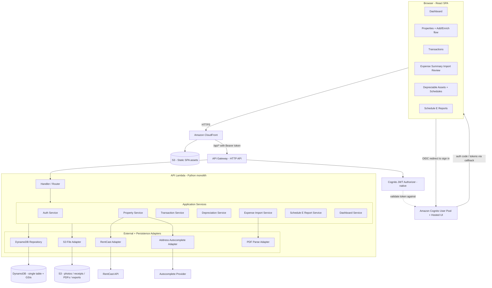
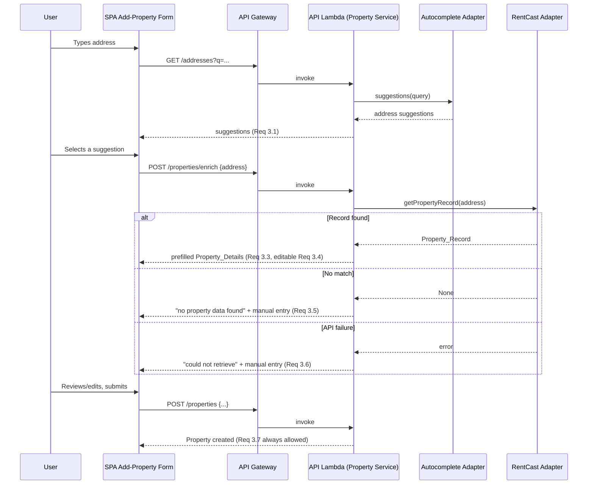

# Design Document

## Overview

Logstead is a single-user, single-LLC web application for preparing an IRS Schedule E (Form 1040) rental return. It captures categorized income and expense transactions, computes straight-line depreciation schedules, enriches property data from RentCast, imports expense-summary PDFs into reviewable draft transactions, and produces per-property and combined Schedule E reports. This document defines the technical design that satisfies the finalized requirements in `requirements.md`.

The application is delivered as a **serverless AWS architecture**: a plain React single-page application (SPA) — built with Vite, with no Next.js — that is client-rendered and hosted on Amazon S3 behind CloudFront, calling a separate HTTP API on Amazon API Gateway that fronts a single monolithic Python AWS Lambda function. The Lambda routes internally to the same logical services (Auth, Property, Transaction, Depreciation, Expense Import, Report, Dashboard). Durable data lives in a single Amazon DynamoDB table using a single-table design; binary files (photos, receipts, uploaded PDFs, exported reports) live in Amazon S3.

The design optimizes for a small footprint that one developer can build, run, and maintain with minimal operational overhead (no servers to patch, pay-per-use scaling), while honoring the extensibility requirement (Requirement 12) so that future record types can be added without reworking existing data.

### Design Goals and Guiding Constraints

- **Tax-return correctness first.** The system of record is whatever is needed to reproduce a Schedule E report from persisted data alone (Requirement 12.5). Aggregations are derived, never the source of truth.
- **Money is exact.** All monetary values are represented as `decimal.Decimal` in code and persisted as fixed two-decimal **strings** in DynamoDB, never as floating point and never as DynamoDB `Number` (which can drift for financial precision). See Data Models and Property 28 (Requirement 13.3).
- **RentCast is an optional enrichment, never a gate.** Property creation always succeeds regardless of RentCast availability (Requirement 3.7).
- **Drafts are not transactions.** Parsed expense-summary line items live as separate staging items in DynamoDB until the user confirms (Requirement 6.6).
- **Simple, modern, accessible UI.** A Monarch-style clean layout that is responsive at a 768px breakpoint and meets WCAG 2.1 AA for color contrast and keyboard navigation (Requirement 14).
- **Delegated authentication, stateless serverless backend.** Authentication is delegated to **Amazon Cognito** (a managed identity provider) using its **Hosted UI**; Logstead does **not** store user passwords (Requirement 1.5). API access is authorized with **Cognito-issued JWTs** (Requirement 1.6). The API Lambda holds no session state — the token accompanies every request — so any Lambda invocation can serve any request.

### Technology Choices (stated and rationale)

These are deliberate, developer-friendly choices for a small, modern serverless web app. They are recommendations the implementation can follow; alternatives are noted where relevant.

| Concern | Choice | Rationale |
| --- | --- | --- |
| Frontend framework | Plain **React built with Vite** + **React Router** (or an equivalently small client-side router) + Tailwind CSS + a headless accessible component library (e.g., Radix UI) | Fast path to a clean, consistent, accessible, responsive UI. No server-side rendering, server actions, or API routes are needed because the backend is a separate HTTP API, so a lightweight React + Vite SPA is simpler and lighter than Next.js while still producing static assets for S3/CloudFront. React Router handles client-side routing. Radix primitives are keyboard- and screen-reader-friendly, supporting the WCAG 2.1 AA target. |
| Frontend hosting | Amazon S3 (static assets) + Amazon CloudFront (CDN, TLS, SPA routing) | Cheap, scalable static hosting; CloudFront serves the SPA and can route unmatched paths back to `index.html` for client-side routing. |
| API edge | Amazon API Gateway (HTTP API) | Managed HTTP front door; integrates with Lambda; provides a native JWT authorizer for validating Cognito tokens; low cost for a single-user app. |
| Compute | A single monolithic AWS Lambda function ("API Lambda") in **Python** | One deployable unit routes internally to all services; keeps cold-start surface and operational complexity low for a small app. |
| Backend language / runtime | Python 3.12 on Lambda | Strong ecosystem for PDF parsing and data work; `decimal.Decimal` for exact money. |
| Internal structure | handler/router → application services → persistence + external adapters | Clean layering preserved inside the single Lambda; business rules live only in services. |
| Database | Amazon DynamoDB, **single-table design** | Serverless, pay-per-request, no connection management from Lambda; single-digit-millisecond reads; sparse attributes fit the optional RentCast field set naturally. |
| DynamoDB access | AWS SDK for Python (`boto3`) resource/client, with a thin repository layer | Type-safe-ish repositories encapsulate the key scheme so services never build keys directly. |
| Money type | `decimal.Decimal` in app code; stored as two-decimal **strings** in DynamoDB | Avoids floating-point error and DynamoDB `Number` drift in depreciation math and aggregation (Requirement 13.3). |
| Auth | **Amazon Cognito User Pool + Hosted UI** (OIDC/OAuth2 Authorization Code + PKCE) for sign-in; **API Gateway HTTP API native JWT authorizer** validating Cognito access/ID tokens; no self-managed credential storage | Offloads credential storage, password policies, and reset flows to a managed provider (Requirement 1.5); API Gateway's built-in JWT authorizer removes the need for a custom Lambda authorizer and validates Cognito-issued tokens (Requirement 1.6). |
| Address autocomplete | A geocoding autocomplete provider (e.g., Google Places Autocomplete or Amazon Location Service) proxied through the API Lambda | RentCast has no autocomplete endpoint; autocomplete only needs to select a clean address string to hand to RentCast (Requirement 3.1–3.2). |
| Property enrichment | RentCast Property Records API (`GET /properties?address=...`) via a server-side adapter in the Lambda | Enumerated field set maps directly to `PropertyDetails` (Requirements 3.8, 12.1). |
| PDF parsing | A Python PDF text extractor (e.g., `pdfplumber` or `pypdf`) running in the API Lambda, plus a line-item parser | Extract date/amount/description rows from a property manager's expense summary (Requirement 6.3) within Lambda time/payload limits. |
| File storage | Amazon S3 (one bucket, prefixed keys) with **pre-signed URLs** for upload/download | Property photos, transaction receipts, uploaded expense-summary PDFs, and exported reports. DynamoDB stores only metadata + S3 keys. |
| Report export | Server-side PDF and CSV generated in the Lambda, delivered via a pre-signed S3 URL (or direct download response) | Downloadable Schedule E report file (Requirement 10.7). |
| Infrastructure as Code | AWS SAM template | Describes API Gateway (HTTP API), the Python Lambda, the DynamoDB table (+ GSIs), and the S3 bucket(s); one-command deploy for a single developer. |
| Testing | `pytest` plus the `Hypothesis` property-based testing library; `moto`/DynamoDB Local for integration | Property tests for depreciation and PropertyDetails round-trip; unit/integration for the rest. |

## Architecture

Logstead is a serverless application with a clear internal separation between the SPA UI, a stateless application/service layer (inside a single Python Lambda) that owns all business rules, and a persistence layer (DynamoDB + S3). External services (RentCast, the address autocomplete provider) are reached only through server-side adapters inside the Lambda so that keys stay server-side and failures are isolated.



### Layering and responsibilities

- **SPA UI layer** (React on S3/CloudFront) renders state and collects input. It performs presentational validation only; authoritative validation lives in the service layer. It talks to the backend exclusively over the HTTP API and holds no privileged secrets.
- **API Gateway + Cognito JWT authorizer** terminate HTTPS and use API Gateway's **native JWT authorizer** to validate the Cognito-issued token on protected routes (issuer, audience, signature, expiry) before forwarding the request to the Lambda. Unauthenticated or invalid-token calls to protected routes are denied so the SPA can redirect to the Cognito Hosted UI sign-in (Requirement 1.1).
- **Handler / router** (inside the Lambda) dispatches the incoming HTTP method + path to the right service method, deserializes input, and shapes the response. It contains no business rules.
- **Application services** own all business rules: validation, Schedule E category mapping, depreciation computation, draft lifecycle, and report aggregation. This is where correctness properties are enforced. Services are pure of transport concerns and are unit/property tested in isolation.
- **Persistence layer**: a DynamoDB **repository** encapsulates the single-table key scheme; an **S3 file adapter** handles object storage and pre-signed URLs. Derived values (report totals, depreciation rows for display) are computed from persisted primitives so a report can always be reproduced from stored data alone (Requirement 12.5).
- **External adapters** wrap RentCast, autocomplete, and PDF parsing. Each converts provider-specific shapes and failures into internal types and never lets a provider outage block a core write path.

### Request / auth flow

Authentication uses the **Amazon Cognito Hosted UI** over OIDC/OAuth2 (Authorization Code + PKCE). An unauthenticated user requesting any protected page is redirected to the **Cognito Hosted UI** sign-in page (Requirement 1.1). On successful authentication, Cognito redirects back to the SPA's registered callback URL with an **authorization code**, which the SPA exchanges (with PKCE) against Cognito's **token endpoint** for the ID and access tokens; the SPA stores the tokens and lands on the dashboard (Requirement 1.2). If authentication fails or is denied, it fails at the Cognito Hosted UI and the user is returned to sign-in with the provider's error, and no session is established in Logstead (Requirement 1.3).

On each API call the SPA sends the Cognito **access/ID token as a Bearer token**. API Gateway's **native JWT authorizer** validates the token against the Cognito User Pool (issuer, audience, signature, expiry) and passes the verified subject and claims to the Lambda via the request context. A missing, malformed, or expired token yields a `401`, which the SPA interprets by routing the user back to the Cognito Hosted UI (Requirements 1.1, 1.3). API access is authorized entirely by the Cognito-issued tokens (Requirement 1.6).

Sign-out clears the locally stored tokens **and** calls the Cognito **logout endpoint** to end the provider session, then returns the user to sign-in (Requirement 1.4). Credential storage and verification are delegated to Cognito, so Logstead stores no passwords (Requirement 1.5). Because the token is self-contained and validated at the edge, the Lambda stays stateless — no server-side session store is required.

### Add-Property enrichment flow



### Deployment (Infrastructure as Code)

An **AWS SAM** template defines the whole stack: the CloudFront distribution + S3 static bucket for the SPA, the **Amazon Cognito User Pool + Hosted UI** (app client with the Authorization Code + PKCE flow, a Cognito domain for the Hosted UI, and the SPA's callback and logout URLs), the API Gateway HTTP API with its **native JWT authorizer configured against the User Pool** (issuer/audience), the single API Lambda (Python), the DynamoDB table with its GSIs, and the S3 file bucket with appropriate CORS and lifecycle. No custom Lambda authorizer is used for authentication. This gives the single developer a one-command, reproducible deploy and keeps all infrastructure versioned alongside the code.

## Components and Interfaces

Interfaces below are expressed in Python-flavored pseudocode (type hints, dataclasses, and `Protocol`-style interfaces) to define contracts, not final signatures. `Money` denotes `decimal.Decimal` constrained to two decimal places; `Result[T]` denotes a success/typed-error outcome. All services live inside the single API Lambda and are invoked by the router.

### Router (all requirements)

```python
def handler(event, context):
    """API Gateway (HTTP API) Lambda entry point.

    1. Extract method + path + body from the proxy event.
    2. For protected routes, the authorizer has already validated the JWT;
       the authenticated user id is read from the request context.
    3. Dispatch to the matching service method (no business rules here).
    4. Serialize the Result[...] into an HTTP response (money -> str).
    """
```

### Auth Component (Requirement 1)

Authentication is delegated to **Amazon Cognito**. Sign-in and sign-out are handled entirely through the Cognito **Hosted UI** OIDC endpoints: the SPA initiates the redirect to the Hosted UI, exchanges the returned authorization code for tokens against Cognito's **token endpoint** (with PKCE), and initiates sign-out via Cognito's **logout endpoint**. The backend implements **no** password verification and stores **no** passwords.

API Gateway's native JWT authorizer validates the Cognito token at the edge, so the API Lambda only needs to read the authenticated user's identity from the request context that the authorizer populates:

```python
@dataclass
class UserContext:
    user_id: str          # Cognito `sub` claim — the stable user identifier
    username: str | None  # e.g., Cognito `cognito:username` or email claim
    claims: dict          # remaining verified token claims

def current_user(event) -> UserContext:
    """Read the verified Cognito subject/claims that API Gateway's
    JWT authorizer placed on the request context. No token parsing or
    signature checking happens here — validation already occurred at the
    edge. Used by services to scope data to the authenticated user (1.6)."""
```

- There is **no** password hashing anywhere in the application; credential storage, verification, password policies, and reset flows all live in Cognito (Requirement 1.5).
- The Cognito `sub` claim is the stable user id used to key the user's data (see Data Models). Because the token is validated at the edge and self-contained, no server-side session record is needed and the Lambda stays stateless.

### Property Service (Requirements 2, 3, 12)

```python
class PropertyService(Protocol):
    def create_property(self, user_id: str, data: PropertyInput) -> Result[Property]: ...        # 2.1, 2.2
    def list_properties(self, user_id: str) -> list[Property]: ...                                # 2.3
    def update_property(self, prop_id: str, changes: PropertyChanges) -> Result[Property]: ...    # 2.4
    def delete_property(self, prop_id: str) -> Result[None]: ...                                  # 2.6 / 2.7 guarded
    def set_usage_days(self, prop_id: str, tax_year: int,
                       fair_rental_days: int, personal_use_days: int) -> None: ...                # 2.8
    def get_property_with_details(self, prop_id: str) -> PropertyWithDetails: ...                 # 2.9, 12.3

class AddressEnrichmentService(Protocol):
    def suggest_addresses(self, query: str) -> list[AddressSuggestion]: ...                       # 3.1
    def enrich(self, selected_address: str) -> EnrichmentResult: ...                              # 3.2-3.6, 3.8

@dataclass
class EnrichmentResult:
    status: Literal["found", "not_found", "unavailable"]   # 3.5 / 3.6
    details: PropertyDetails | None = None
```

- `create_property` rejects empty name or empty address with a field-identifying message (Requirement 2.2) but never depends on enrichment succeeding (Requirement 3.7).
- `delete_property` checks for associated transactions and depreciable assets before deleting; if any exist it rejects with a "remove associated records first" message (Requirement 2.7); otherwise it deletes the property partition (Requirement 2.6).
- `PropertyDetails` fields are all individually optional and written only when a provider value is present (Requirements 2.9, 3.3, 12.2).

### RentCast Adapter (Requirements 3, 12)

```python
class RentCastAdapter(Protocol):
    def get_property_record(self, address: str) -> Result[PropertyRecord | None]: ...
    # Maps RentCast /properties response -> PropertyDetails, present fields only.
```

- Calls `GET /properties?address=<selected address>` with the API key in a server-held header inside the Lambda. RentCast's Property Records endpoint accepts a full address and returns records for it; there is no separate autocomplete endpoint, which is why address suggestions come from a dedicated autocomplete adapter. (See [RentCast Property Records](https://developers.rentcast.io/reference/property-records) and [Search Queries](https://developers.rentcast.io/reference/search-queries). Content was rephrased for compliance with licensing restrictions.)
- The adapter maps the returned record into `PropertyDetails`, copying only fields RentCast actually provides and leaving the rest unset (Requirements 3.3, 12.2). A 404/empty result maps to `None` (→ not_found); a network/5xx/timeout maps to an error (→ unavailable). A bounded HTTP timeout keeps a slow provider from consuming the Lambda's execution budget.

### Photo Component (Requirement 4)

```python
class PhotoService(Protocol):
    def request_upload(self, prop_id: str, content_type: str,
                       filename: str) -> Result[PresignedUpload]: ...   # 4.1, 4.2 (type-checked)
    def confirm_upload(self, prop_id: str, key: str,
                       content_type: str, filename: str) -> PropertyPhoto: ...  # 4.1 (metadata write)
    def list(self, prop_id: str) -> list[PropertyPhoto]: ...            # 4.3
    def delete(self, photo_id: str) -> None: ...                        # 4.4 (S3 object + metadata item)
```

- Upload validates the declared content type against an accepted-image allow-list (e.g., JPEG, PNG, WebP, HEIC); a rejected type yields a message naming the accepted types (Requirement 4.2). The service returns a **pre-signed S3 PUT URL** for the browser to upload directly to S3, then records a `PropertyPhoto` metadata item (S3 key, content type, filename) in DynamoDB. Photos exist because RentCast records do not include images (Requirement 4 intro). Delete removes both the S3 object and the metadata item (Requirement 4.4).

### Transaction Service (Requirements 5, 7)

```python
class TransactionService(Protocol):
    def create(self, data: TransactionInput) -> Result[Transaction]: ...          # 5.1, 5.2, 5.3, 7.3, 7.4
    def list_for_property(self, prop_id: str,
                          tax_year: int | None = None) -> list[Transaction]: ...   # 5.4 (date desc), 5.5
    def update(self, tx_id: str, changes: TransactionChanges) -> Result[Transaction]: ...  # 5.6
    def delete(self, tx_id: str) -> None: ...                                      # 5.7
    def attach_receipt(self, tx_id: str, content_type: str,
                       filename: str) -> Result[PresignedUpload]: ...              # 5.8 (S3 pre-signed)
```

- Validation rejects amount ≤ 0 (Requirement 5.2) and any missing property, date, amount, or category (Requirement 5.3).
- Assigning a category records the mapping to the corresponding `Schedule_E_Line` (Requirement 7.3). Selecting the "Other" expense category (Line 19) requires a free-text description (Requirement 7.4).
- Listing returns transactions **date-descending** directly from the DynamoDB query (see Data Models); an optional tax-year filter restricts to transactions whose date falls in that year via a key prefix (Requirements 5.4, 5.5).
- Receipt attachment stores the file in S3 via a pre-signed URL and records a `Document` metadata item (Requirement 5.8).

### Schedule E Category Catalog (Requirement 7)

A fixed, code-defined catalog (not user-editable), seeded as reference items in DynamoDB, maps each category to its Schedule E line:

- Income: Rents received (Line 3), Royalties received (Line 4). (Requirement 7.1)
- Expense: Advertising (5), Auto and travel (6), Cleaning and maintenance (7), Commissions (8), Insurance (9), Legal and other professional fees (10), Management fees (11), Mortgage interest paid to banks (12), Other interest (13), Repairs (14), Supplies (15), Taxes (16), Utilities (17), Other (19). (Requirement 7.2)
- Depreciation (Line 18) is **not** a user-assignable category; it is populated only by the depreciation engine (Requirements 7.5, 10.3).

### Depreciation Service (Requirements 8, 9)

```python
class DepreciationService(Protocol):
    def create_asset(self, data: AssetInput) -> Result[DepreciableAsset]: ...   # 8.1-8.4
    def update_asset(self, asset_id: str, changes: AssetChanges) -> Result[DepreciableAsset]: ...  # 8.5 (recompute)
    def delete_asset(self, asset_id: str) -> None: ...                          # 8.6 (cascade schedule)
    def list_assets(self, prop_id: str) -> list[DepreciableAsset]: ...          # 8.7
    def compute_schedule(self, asset: DepreciableAsset) -> DepreciationSchedule: ...  # 9.1-9.3
    def schedule_for(self, asset_id: str) -> list[DepreciationScheduleRow]: ... # 9.4
    def property_depreciation_for_year(self, prop_id: str, tax_year: int) -> Money: ...  # 9.5

@dataclass
class DepreciationScheduleRow:
    tax_year: int
    amount: Money          # depreciation for that year
    remaining_basis: Money # basis remaining after that year
```

The straight-line + mid-month computation is the correctness-critical core and is performed with `decimal.Decimal`:

- Annual full-year depreciation = `cost_basis / recovery_period_years`.
- **First year** uses the mid-month convention: the asset is treated as placed in service in the middle of its `placed_in_service_date` month, so the first-year fraction is `(12.5 - placed_in_service_month) / 12` (i.e., a full month for each month after the placed-in-service month, plus half of the placed-in-service month).
- **Final (partial) year** receives the remainder needed so the schedule fully recovers the basis.
- Each yearly amount is quantized to two decimals with `decimal.Decimal`, and the rounding residual is assigned to the final year so that the **sum of all annual amounts exactly equals the cost basis** (Requirement 9.3). This last-row reconciliation is what makes the sum-equals-basis invariant hold under rounding.

### Expense Import Service (Requirement 6)

```python
class ExpenseImportService(Protocol):
    def start_import(self, file_key: str, prop_id: str,
                     tax_year: int, content_type: str) -> Result[ImportSession]: ...  # 6.1, 6.2, 6.3, 6.12
    def get_drafts(self, import_session_id: str) -> list[DraftTransaction]: ...        # 6.5
    def update_draft(self, draft_id: str, changes: DraftChanges) -> DraftTransaction: ...  # 6.7, 6.9 re-flag
    def remove_draft(self, draft_id: str) -> None: ...                                 # 6.8
    def confirm(self, import_session_id: str) -> Result[ConfirmOutcome]: ...           # 6.10, 6.11

@dataclass
class DraftTransaction:
    id: str
    date: date | None = None
    amount: Money | None = None
    description: str | None = None
    type: Literal["income", "expense"] | None = None
    category_id: str | None = None
    missing_fields: list[str] = field(default_factory=list)   # 6.9

@dataclass
class ConfirmOutcome:
    created: list[Transaction]      # 6.10
    rejected: list[RejectedDraft]   # 6.11
```

- The PDF is uploaded to S3 (pre-signed) first; `start_import` receives the S3 key. Non-PDF uploads are rejected with a "PDF required" message (Requirement 6.2). The import is associated with the selected property and tax year (Requirement 6.1).
- Parsing runs inside the API Lambda using a Python PDF text extractor (`pdfplumber`/`pypdf`), extracting date/amount/description per line item where available (Requirement 6.3) and attempting to map each draft to a Schedule E expense category using keyword heuristics over the description (Requirement 6.4). Parse time is bounded so it stays within the Lambda execution limit; typical property-manager summaries are small. If a document is too large or slow to parse, it is treated as a parse failure (Requirement 6.12).
- Drafts are held as **staging items in DynamoDB** under the import session; **no `Transaction` is created while the user is still reviewing** (Requirement 6.6). Drafts are editable (Requirement 6.7) and removable (Requirement 6.8). A draft missing date, amount, or category is flagged so the user completes it before confirming (Requirement 6.9).
- On confirm, each remaining draft is validated against the same Transaction rules from Requirement 5; passing drafts become `Transaction` items associated with the property (Requirement 6.10), and any draft failing validation is rejected with a field-identifying message rather than silently dropped (Requirement 6.11).
- If parsing fails or yields zero line items, the user is told no transactions could be extracted and may enter them manually (Requirement 6.12).

### Schedule E Report Service (Requirement 10)

```python
class ScheduleEReportService(Protocol):
    def report_for(self, prop_id: str, tax_year: int) -> ScheduleEReport: ...      # 10.1-10.5
    def combined_report(self, user_id: str, tax_year: int) -> CombinedScheduleEReport: ...  # 10.6
    def export(self, report: ScheduleEReport | CombinedScheduleEReport,
               fmt: Literal["pdf", "csv"]) -> DownloadableFile: ...                # 10.7
```

- A report aggregates the property's transactions within the tax year into totals keyed by `Schedule_E_Line` (Requirement 10.1), fills Line 18 from the depreciation schedules (Requirement 10.3), and computes total income, total expenses, and net income/loss (Requirement 10.4). Aggregation reads transactions via a single tax-year-scoped DynamoDB query (see access patterns).
- The header carries property address, property type, fair rental days, and personal use days for the year (Requirement 10.2). "Other" (Line 19) expenses are itemized with their descriptions (Requirement 10.5).
- The combined report lays out per-property columns plus a totals column matching the Schedule E form (Requirement 10.6). Export generates the PDF/CSV in the Lambda, writes it to S3, and returns a pre-signed download URL (or a direct download response) (Requirement 10.7).
- All report figures are derived from persisted transactions, assets, schedules, and usage-day items — never from cached aggregates — so any report is reproducible from stored data alone (Requirement 12.5).

### Dashboard Component (Requirement 11)

```python
class DashboardService(Protocol):
    def portfolio_summary(self, user_id: str, tax_year: int) -> PortfolioSummary: ...  # 11.1, 11.3
    def per_property_summary(self, user_id: str, tax_year: int) -> list[PropertySummary]: ...  # 11.2, 11.3
    def has_properties(self, user_id: str) -> bool: ...                                # 11.4
```

- Defaults to the current tax year, with a selector to switch years (Requirement 11.3). When the LLC has no properties, the dashboard shows an "add your first property" prompt (Requirement 11.4). Summaries are derived by aggregating each property's tax-year transactions.

> **Future direction (not current scope):** The current release renders the dashboard as numeric income, expense, and net summaries per Requirement 11 — no charts are in scope now. Future visualization/chart work is expected to layer a dedicated React charting library (e.g., Recharts, with Visx or Nivo as alternatives) onto the existing React + Tailwind SPA, since a dedicated charting library composes naturally with React + Tailwind, preserves the Monarch-style aesthetic (Requirement 14), and offers more flexibility for custom financial visualizations than a built-in component set. This is a planned direction only and adds no new acceptance-criteria behavior to the current release.

### Navigation and Responsive Shell (Requirement 14)

- A persistent navigation shell links Dashboard, Properties, Transactions, Depreciable Assets, and Schedule E Reports (Requirement 14.1).
- Layout switches from multi-column (≥768px) to single-column (<768px) via responsive breakpoints (Requirement 14.2).
- Validation messages render adjacent to the offending field (Requirement 14.3). Components are built on accessible primitives and verified for color-contrast and keyboard-navigation conformance to WCAG 2.1 AA (Requirement 14.4). Full conformance requires manual assistive-technology testing in addition to automated checks.

## Data Models

The **single DynamoDB table** is the system of record. All entities share one table and are distinguished by key prefixes and a `type` attribute. Money attributes are stored as **strings** (e.g., `"1234.56"`) and parsed to `decimal.Decimal` in code, preserving exact two-decimal precision and avoiding DynamoDB `Number` drift (Requirement 13.3). Optional RentCast attributes are simply **not written** when absent, so a sparse item naturally represents "unset" fields (Requirements 12.2, 12.3).

### Single-table key design

- **Table name:** `Logstead`
- **Partition key:** `PK` (string)
- **Sort key:** `SK` (string)
- Most entities belonging to a property are co-located under a single partition `PK = PROPERTY#<propertyId>`, so a property and all its child records can be read with one query. The user owns properties under `PK = USER#<userId>`.

Global Secondary Indexes:

- **GSI1** (`GSI1PK`, `GSI1SK`): reverse/cross-cutting lookups — used to list all of a user's properties, to scope a combined report across properties for a tax year, and to look up a draft/import by session.
- **GSI2** (`GSI2PK`, `GSI2SK`): tax-year-scoped transaction access across a property for reporting/filtering, and photo/document listing where needed.

(Two GSIs are sufficient for the access patterns below; they can be added incrementally as the schema evolves.)

### Item types

| Entity | PK | SK | Key GSI attributes | Notes |
| --- | --- | --- | --- | --- |
| **User** (Req 1) | `USER#<cognitoSub>` | `PROFILE` | — | App-level profile only: `displayName`, `createdAt`. Identity is owned by Cognito; `<cognitoSub>` (the Cognito `sub` claim) is the user id. **No password is stored** — credential storage/verification is delegated to Cognito (Requirement 1.5). |
| **Property** (Req 2, 12) | `USER#<userId>` | `PROP#<propertyId>` | `GSI1PK=USER#<userId>`, `GSI1SK=PROP#<propertyId>` | `name`, `addressText`, `propertyType`, `createdAt`, `updatedAt`. Also mirrored as `PK=PROPERTY#<propertyId>, SK=META` for child co-location. Unlimited per user (Req 2.5). |
| **PropertyDetails** (Req 2.9, 3.8, 12.1-12.3) | `PROPERTY#<propertyId>` | `DETAILS` | — | One item per property. Every attribute nullable; **absent attributes are not written**. Address group, geo, structure, and a nested `features` map (`architectureType`, `heating`, `cooling`, `garage`, `pool`, `roofType`). Round-trip preserves present values, reports absent as unset. |
| **PropertyUsageYear** (Req 2.8, 10.2) | `PROPERTY#<propertyId>` | `USAGE#<taxYear>` | — | `fairRentalDays`, `personalUseDays`. One per (property, year). |
| **PropertyPhoto** (Req 4) | `PROPERTY#<propertyId>` | `PHOTO#<photoId>` | — | `s3Key`, `contentType`, `originalFilename`, `uploadedAt`. Binary lives in S3. |
| **ScheduleECategory** (Req 7) reference | `CATEGORY#<categoryId>` | `META` | — | `kind` (income/expense), `label`, `scheduleELine` (int), `requiresDescription` (Line 19). Seeded; Line 18 intentionally absent. |
| **Transaction** (Req 5, 7, 13) | `PROPERTY#<propertyId>` | `TXN#<invDate>#<txnId>` | `GSI2PK=PROPERTY#<propertyId>#YEAR#<taxYear>`, `GSI2SK=TXN#<invDate>#<txnId>` | `date`, `amount` (string), `type`, `categoryId`, `scheduleELine`, `description` (required for Line 19), timestamps. `<invDate>` = inverted date for descending order (see below). |
| **Document** (receipt, Req 5.8) | `PROPERTY#<propertyId>` | `TXN#<invDate>#<txnId>#DOC#<docId>` | — | `s3Key`, `contentType`, `originalFilename`. |
| **DepreciableAsset** (Req 8, 9) | `PROPERTY#<propertyId>` | `ASSET#<assetId>` | — | `description`, `costBasis` (string), `placedInServiceDate`, `recoveryPeriodYears` (default 27.5), timestamps. |
| **DepreciationScheduleRow** (Req 9) | `PROPERTY#<propertyId>` | `ASSET#<assetId>#SCHED#<taxYear>` | `GSI2PK=PROPERTY#<propertyId>#YEAR#<taxYear>`, `GSI2SK=SCHED#<assetId>` | `amount` (string), `remainingBasis` (string), `method=straight_line`, `convention=mid_month`. Recomputed on asset create/update; cascade-deleted with the asset. Schedule "header" data lives on the asset item. |
| **ImportSession** (Req 6) | `IMPORT#<importSessionId>` | `META` | `GSI1PK=PROPERTY#<propertyId>`, `GSI1SK=IMPORT#<importSessionId>` | `propertyId`, `taxYear`, `pdfS3Key`, `status` (parsing/review/confirmed/failed), `createdAt`. |
| **DraftTransaction** (Req 6) | `IMPORT#<importSessionId>` | `DRAFT#<draftId>` | — | `date?`, `amount?` (string), `description?`, `type?`, `categoryId?`, `missingFields` (list). Staging only — never surfaces in Schedule E aggregation until confirmed into a `Transaction`. |

### Date-descending ordering and tax-year scoping (Requirements 5.4, 5.5)

- **Descending by date without a `ScanIndexForward` flip trick tied to a single query direction:** transactions use an **inverted date** in the sort key, `<invDate> = (99999999 - YYYYMMDD)`. Because DynamoDB returns items in ascending sort-key order by default, encoding an inverted date makes the natural ascending scan yield **most-recent-first**, satisfying "ordered by date descending" (Requirement 5.4) for `Query(PK = PROPERTY#<id>, SK begins_with "TXN#")`. (Equivalently, a normal date key with `ScanIndexForward=false` also works; the inverted-key approach keeps the ordering stable across indexes.)
- **Tax-year filter:** transactions are also written with `GSI2PK = PROPERTY#<propertyId>#YEAR#<taxYear>`. Filtering to a tax year (Requirement 5.5) is a single `Query` on GSI2 for that partition — no scan, no client-side filtering. The GSI2 sort key reuses the inverted-date form so year-scoped results are likewise date-descending.

### Access patterns

| Access pattern | Requirement | How served |
| --- | --- | --- |
| List all properties for the user | 2.3 | `Query(PK=USER#<userId>, SK begins_with "PROP#")` |
| Get a property + its details | 2.9, 3.3, 12.3 | `Query(PK=PROPERTY#<id>, SK IN {META, DETAILS})` (or two `GetItem`s) |
| List transactions for a property, date desc | 5.4 | `Query(PK=PROPERTY#<id>, SK begins_with "TXN#")` — inverted-date SK yields newest first |
| Filter transactions by tax year | 5.5, 10.1 | `Query(GSI2, GSI2PK=PROPERTY#<id>#YEAR#<taxYear>, SK begins_with "TXN#")` |
| List depreciable assets for a property | 8.7 | `Query(PK=PROPERTY#<id>, SK begins_with "ASSET#")` (filter out `#SCHED#`) |
| Get a depreciation schedule for an asset | 9.4 | `Query(PK=PROPERTY#<id>, SK begins_with "ASSET#<assetId>#SCHED#")` |
| Property depreciation for a tax year | 9.5, 10.3 | `Query(GSI2, GSI2PK=PROPERTY#<id>#YEAR#<taxYear>, SK begins_with "SCHED#")` and sum |
| Aggregate a property+tax-year report by Schedule E line | 10.1 | Year-scoped transaction query (GSI2) + year-scoped schedule query; fold into line totals |
| Combined report across all properties for a tax year | 10.6 | List properties (GSI1), then per property run the year-scoped queries; sum into a totals column |
| Usage days for a property/year | 2.8, 10.2 | `GetItem(PK=PROPERTY#<id>, SK=USAGE#<taxYear>)` |
| List photos for a property | 4.3 | `Query(PK=PROPERTY#<id>, SK begins_with "PHOTO#")` |
| List drafts for an import session | 6.5 | `Query(PK=IMPORT#<importSessionId>, SK begins_with "DRAFT#")` |
| List Schedule E categories | 7.1, 7.2 | `Query` on the seeded `CATEGORY#*` items (small, cacheable) |

### Sparse RentCast fields (Requirements 12.1-12.3)

The `PropertyDetails` item stores only the attributes RentCast actually returns; absent attributes are omitted from the `PutItem`. Reading the item back yields exactly the present attributes, and the mapping layer reports any attribute not present as unset. This gives round-trip preservation without a rigid column schema — the natural strength of a schemaless item store for a sparse, provider-driven field set.

### Extensibility (Requirements 12.6, 12.7)

Future record types (repairs, granular day-to-day expenses, maintenance/service log) are added as **new item types under the existing `PROPERTY#<propertyId>` partition** using new `SK` prefixes (e.g., `REPAIR#`, `LOG#`), and/or new GSI projections, **without altering the stored representation of existing** `Property`, `Transaction`, `PropertyDetails`, or `DepreciableAsset` items. The initial release ships only the item types above; the future record types are intentionally excluded from current functional behavior (Requirement 12.7).

## Correctness Properties

*A property is a characteristic or behavior that should hold true across all valid executions of a system — essentially, a formal statement about what the system should do. Properties serve as the bridge between human-readable specifications and machine-verifiable correctness guarantees.*

The following properties were derived from the acceptance-criteria prework and consolidated to remove redundancy. Each is universally quantified and intended to be implemented as a single property-based test (using Hypothesis) running at least 100 iterations. The properties are stack-independent; only the underlying implementation (Python `decimal.Decimal`, DynamoDB persistence) changes from the prior design.

### Property 1: API access requires a valid identity token

*For any* request to a protected route, the request is processed (reaching the service layer with a resolved user identity) only when it is accompanied by a valid, unexpired Cognito-issued token whose verified claims identify the user; requests with a missing, malformed, or expired token are rejected without side effects (no data is read or written on the user's behalf).

**Validates: Requirements 1.1, 1.6** (Requirement 1.5 — credential storage and verification — is satisfied by delegation to Cognito rather than by Logstead code, and is therefore covered by design and integration testing rather than a unit-level property.)

### Property 2: Property creation rejects blank name or address

*For any* property submission whose name or address is empty or whitespace-only, creation is rejected and the validation message identifies the offending field; when both are non-blank (and type valid) creation is accepted.

**Validates: Requirements 2.2**

### Property 3: Property deletion is guarded by associations

*For any* property with an arbitrary set of associated transactions and depreciable assets, deletion succeeds exactly when both sets are empty, and is otherwise rejected with a "remove associated records first" message.

**Validates: Requirements 2.6, 2.7**

### Property 4: Property_Details round-trip preserves present fields

*For any* Property_Details value with an arbitrary subset of its fields present (and the rest absent), persisting and then retrieving it returns every present field unchanged and reports every absent field as unset, without error; likewise, mapping a RentCast record populates exactly the fields the record provides. In the DynamoDB model this holds because absent attributes are never written and present attributes are read back verbatim.

**Validates: Requirements 2.9, 3.3, 3.8, 12.1, 12.2, 12.3**

### Property 5: Property creation succeeds regardless of RentCast availability

*For any* enrichment outcome (record found, no match, or provider unavailable), submitting an otherwise-valid property results in the property being created.

**Validates: Requirements 3.7**

### Property 6: Photo upload accepts exactly the allowed image types

*For any* uploaded file with a content type, the upload is accepted (a pre-signed URL issued and metadata recorded) if and only if the content type is in the accepted image allow-list; otherwise it is rejected with a message naming the accepted types.

**Validates: Requirements 4.2**

### Property 7: Transaction validation rejects invalid amounts and missing fields

*For any* transaction submission, creation is rejected when the amount is less than or equal to zero, or when any of property, date, amount, or category is missing, and the message identifies a failing field; a submission with all required fields present and amount greater than zero is accepted.

**Validates: Requirements 5.2, 5.3**

### Property 8: Transaction listing is ordered by date descending

*For any* set of transactions for a property, the listing is a permutation of that set ordered by date descending.

**Validates: Requirements 5.4**

### Property 9: Tax-year filter returns exactly in-year transactions

*For any* set of transactions and any tax year, the filtered listing contains exactly those transactions whose date falls within that tax year.

**Validates: Requirements 5.5**

### Property 10: No transaction exists before draft confirmation

*For any* set of draft transactions parsed from an expense summary, while the import session remains unconfirmed no Transaction is created for that import and the transaction store is unchanged.

**Validates: Requirements 6.6**

### Property 11: Draft missing-fields flag is exact

*For any* draft transaction, the flagged missing-fields set equals exactly the subset of required fields (date, amount, category) that are unset.

**Validates: Requirements 6.9**

### Property 12: Confirmation partitions drafts into created and rejected

*For any* set of reviewed drafts, confirming creates exactly one Transaction (associated with the selected property) for each draft satisfying the Requirement 5 validation rules, and rejects each remaining draft with a message identifying the failing field; the count of created transactions equals the count of valid drafts.

**Validates: Requirements 6.10, 6.11**

### Property 13: Category assignment records the correct Schedule E line

*For any* user-assignable Transaction_Category, assigning it to a transaction records the Schedule E line defined for that category in the fixed catalog.

**Validates: Requirements 7.1, 7.2, 7.3**

### Property 14: No assignable category maps to the depreciation line

*For every* user-assignable Transaction_Category, its Schedule E line is not Line 18.

**Validates: Requirements 7.5**

### Property 15: Other expenses require a description

*For any* transaction assigned the Other category (Line 19), creation is rejected when the description is blank and accepted when a non-blank description is present.

**Validates: Requirements 7.4**

### Property 16: Asset validation rejects invalid basis and missing fields

*For any* depreciable-asset submission, creation is rejected when the cost basis is less than or equal to zero, or when any of property, description, cost basis, placed-in-service date, or recovery period is missing, and the message identifies a failing field; an otherwise-valid submission with cost basis greater than zero is accepted.

**Validates: Requirements 8.2, 8.3**

### Property 17: Depreciation schedule is straight-line with mid-month convention

*For any* depreciable asset, the computed schedule uses the straight-line method over the recovery period, applies the mid-month convention to the first and final tax years (first-year amount equals the full annual amount scaled by the mid-month fraction, within rounding), spans the correct number of tax years, and equals a freshly recomputed schedule after any edit to cost basis, placed-in-service date, or recovery period.

**Validates: Requirements 9.1, 9.2, 8.5**

### Property 18: Depreciation sums to the cost basis

*For any* valid depreciable asset, the sum of all annual depreciation amounts in its schedule equals the asset's cost basis exactly at two-decimal precision.

**Validates: Requirements 9.3**

### Property 19: Remaining basis is consistent and terminates at zero

*For any* depreciable asset schedule, the remaining basis after each tax year equals the cost basis minus the cumulative depreciation through that year, the sequence is non-increasing, and the final remaining basis is zero.

**Validates: Requirements 9.4**

### Property 20: Property-year depreciation equals the sum across assets

*For any* property and tax year, the total property depreciation equals the sum of each asset's scheduled depreciation amount for that year.

**Validates: Requirements 9.5**

### Property 21: Report aggregation is correct and balances

*For any* set of transactions for a property and tax year, each Schedule E line total equals the sum of that year's transactions assigned to that line, and the report's net income or loss equals total income minus total expenses.

**Validates: Requirements 10.1, 10.4**

### Property 22: Report depreciation line equals computed depreciation

*For any* property and tax year, the report's Line 18 value equals the total property depreciation for that year computed from the depreciation schedules.

**Validates: Requirements 10.3**

### Property 23: Other expenses are itemized and reconcile

*For any* set of Other-category transactions in a report, each appears in the Line 19 itemization with its description and amount, and the itemized amounts sum to the Line 19 total.

**Validates: Requirements 10.5**

### Property 24: Combined report totals equal per-property sums

*For any* set of per-property reports for a tax year, each line's value in the totals column equals the sum of that line across all per-property columns.

**Validates: Requirements 10.6**

### Property 25: Report header reflects stored usage days

*For any* property and tax year with stored fair rental days and personal use days, the report header reports those exact values.

**Validates: Requirements 2.8, 10.2**

### Property 26: Dashboard net equals the sum of per-property nets

*For any* set of properties and transactions for a tax year, the dashboard portfolio net income or loss equals the sum of the per-property net income or loss values for that year.

**Validates: Requirements 11.1, 11.2**

### Property 27: Reports are reproducible from persisted data alone

*For any* persisted data set, computing a Schedule E report twice from stored data (with no cached aggregates) yields identical line totals, depreciation, and net results.

**Validates: Requirements 12.5**

### Property 28: Monetary amounts preserve two-decimal precision

*For any* monetary amount, persisting it (as a two-decimal string in DynamoDB) and then retrieving and parsing it back to `decimal.Decimal` returns the same value at exactly two decimal places, with no floating-point or numeric-type drift.

**Validates: Requirements 13.3**

## Error Handling

Errors are handled at the layer that owns the relevant rule, and are surfaced to the SPA as field-adjacent validation messages (Requirement 14.3) or as non-blocking notices where a core action can still proceed. The API Lambda maps internal `Result` errors to appropriate HTTP status codes so the SPA can render them.

### Validation errors (client-recoverable)
- Property, transaction, and asset validation failures return a structured result (HTTP 400) naming the offending field, rendered next to that field by the SPA (Requirements 2.2, 5.2, 5.3, 8.2, 8.3, 14.3).
- Photo and expense-summary uploads with the wrong file type are rejected before a pre-signed URL is issued, with a message listing the accepted types / requiring a PDF (Requirements 4.2, 6.2).
- The "Other" category without a description and drafts missing required fields are flagged before the action can complete (Requirements 6.9, 7.4).

### External-service errors (degrade, never block)
- **Address autocomplete** failure: suggestions are simply unavailable; the user can still type and submit an address manually.
- **RentCast** returns no match → `not_found`, shown as "no property data found" with manual entry enabled (Requirement 3.5). RentCast network/timeout/5xx → `unavailable`, shown as "property data could not be retrieved" with manual entry enabled (Requirement 3.6). In both cases property creation still succeeds (Requirement 3.7). The adapter uses a bounded HTTP timeout so a slow provider cannot exhaust the Lambda execution budget or hang the form.
- **PDF parsing** failure, an oversized document, or one that yields no line items → "no transactions could be extracted," with manual entry offered; no drafts and no transactions are created (Requirement 6.12).
- **S3** failure on photo/receipt/PDF/export operations returns a retryable error; because pre-signed uploads write directly to S3, the DynamoDB metadata item is written only after a confirmed upload, so a failed upload never leaves a dangling record.

### Confirmation-time errors (import)
- On confirm, invalid drafts are individually rejected and reported by field while valid drafts still commit; the failure of one draft does not abort the others (Requirements 6.10, 6.11).

### Integrity and persistence errors
- Property, Transaction, and DepreciableAsset writes that must be all-or-nothing (e.g., asset + its recomputed schedule rows, or a multi-item create) use a **DynamoDB `TransactWriteItems`** so the change is either fully persisted (and visible after re-authentication) or not applied (Requirement 13.1). Because entity children are co-located under the `PROPERTY#<id>` partition, related writes stay within transaction limits.
- Deleting a property with associated records is refused at the service layer (after querying the property partition for `TXN#`/`ASSET#` items) before any delete is issued (Requirement 2.7).

### Auth errors
- Failed or denied authentication happens at the **Cognito Hosted UI**; Cognito surfaces the error and returns the user to sign-in, and no session is established in Logstead (Requirement 1.3). Logstead performs no credential checking of its own, so there is no app-side "which field was wrong" logic.
- Requests to protected routes with a missing, malformed, or expired token are rejected by **API Gateway's Cognito JWT authorizer** with an HTTP 401 before reaching the Lambda; the SPA responds by routing the user to the Cognito Hosted UI rather than showing an error page (Requirements 1.1, 1.6).

## Testing Strategy

Logstead uses a dual approach: property-based tests for the pure computational and rule-based logic, and example/integration tests for I/O, external services, and UI. The backend test suite runs on **`pytest`**.

### Property-based tests
Property-based testing is appropriate here because the tax-critical core — depreciation math, Schedule E aggregation, category-to-line mapping, draft lifecycle, and PropertyDetails persistence — consists of pure functions with universal properties over large input spaces.

- Library: **`Hypothesis`** (do not hand-roll property testing).
- Each of Properties 1–28 above is implemented by a **single** property-based test.
- Each property test runs a **minimum of 100 iterations** (e.g., via Hypothesis' `max_examples` setting).
- Each test is tagged with a comment referencing its design property, in the format:
  `# Feature: logstead, Property {number}: {property_text}`
- Generators (Hypothesis strategies) of note:
  - Money: two-decimal `Decimal` values over a realistic range, including boundary values (`0.00`, `0.01`, large amounts) to guard against numeric drift when round-tripping through DynamoDB string storage (Properties 18, 19, 28).
  - Depreciable assets: random cost basis, recovery periods (including 27.5), and placed-in-service dates spanning all twelve months to exercise the mid-month convention (Properties 17, 18, 19).
  - PropertyDetails: records with random subsets of fields present/absent to exercise round-trip preservation, including the sparse-attribute DynamoDB representation (Property 4).
  - Transactions: random dates across years, income/expense types, and categories to exercise ordering, filtering, and aggregation (Properties 8, 9, 21).
  - RentCast payloads: mocked records with arbitrary field subsets and outcome types (found/not_found/unavailable) so external calls are simulated, not made live (Properties 4, 5).

### Unit / example tests
Cover specific scenarios and edge cases not suited to universal properties: token-claim extraction via the `current_user(event)` helper — resolving the Cognito `sub`/claims from the request context and scoping data to that user (1.6), CRUD happy paths (2.1, 2.3, 2.4, 5.1, 5.6, 5.7, 8.1, 8.6, 8.7), the 27.5-year default (8.4), PDF line-item extraction against representative expense-summary fixtures (6.3, 6.4), no-match/failure branches (3.5, 3.6, 6.12), and empty-state/UI branches (11.4, 14.3).

### Integration tests
Cover the boundaries that involve real infrastructure with 1–3 representative examples each:
- API Gateway's **Cognito JWT authorizer** route guarding: valid tokens reach the Lambda while missing/malformed/expired tokens are rejected with 401 (verifying the SPA's redirect-to-Hosted-UI behavior), exercised against the Cognito User Pool or a stubbed JWKS endpoint (1.1, 1.3, 1.6).
- **DynamoDB** persistence round-trips — including across simulated sign-out/sign-in — run against **DynamoDB Local** or **`moto`**, verifying the single-table key scheme, date-descending ordering, tax-year GSI queries, and money string round-trips (13.1, 13.2, 5.4, 5.5, 28).
- The **RentCast adapter** against a recorded/stubbed HTTP response.
- The **address autocomplete adapter** (stubbed).
- **S3** operations (photos/receipts/PDFs/exports), exercised with `moto` or a local S3 stub, including pre-signed URL issuance.
- Report export to a downloadable file via a pre-signed S3 URL (10.7).

### UI and accessibility tests
Snapshot/component tests for the responsive layout breakpoint at 768px (14.2) and navigation structure (14.1); automated accessibility checks (e.g., axe) for color contrast and keyboard navigation, with the caveat that full WCAG 2.1 AA conformance also requires manual testing with assistive technologies and expert review (14.4).
