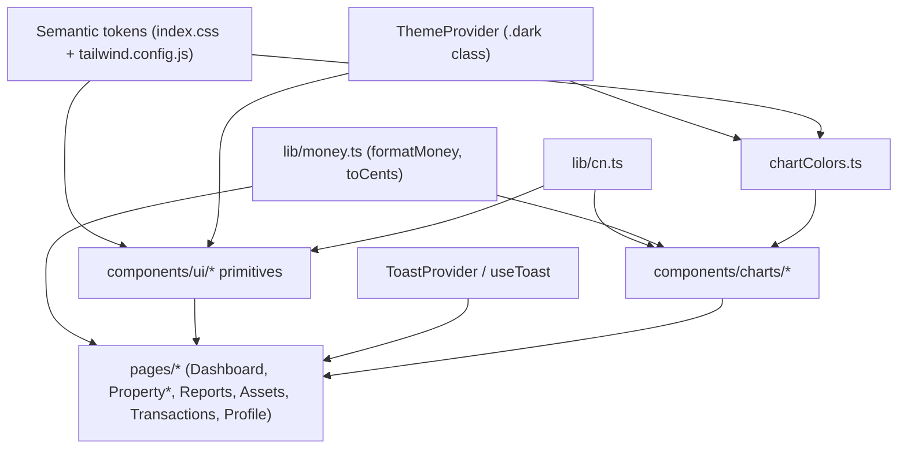

# Design Document

## Overview

This design turns the approved requirements for **UI Polish (Part A)** and **Visualizations (Part B)** into a concrete plan grounded in the existing Logstead frontend (`frontend/`, React 19 + Vite 6 + TypeScript + Tailwind 3 + Radix UI). It layers onto the current architecture in three deliberate stages:

1. **Foundation — shared UI primitives** (`frontend/src/components/ui/`). A small, dependency-light primitive library (Button, Input, Card/Tile, Select, ConfirmDialog, Toast) that replaces the copy-pasted Tailwind class strings scattered across pages. Everything else builds on this. (Requirements 1, 4, 5, 8.)
2. **Wayfinding & polish** — property-name breadcrumbs, removal of raw identifiers, consistent success/failure feedback, responsive tables, unified money formatting, print-friendly reports. (Requirements 2, 3, 6, 7, 9, 10.)
3. **Charts** — an accessibility-first, theme-aware, lazy-loaded chart layer (`frontend/src/components/charts/`) that always renders alongside a data table and consumes exact-integer-cents data. (Requirements 11–20.)

The design intentionally reuses what already works: the semantic color-token system in `frontend/src/index.css` + `frontend/src/tailwind.config.js`, the `.dark`-class theme flip driven by `frontend/src/theme/ThemeProvider.tsx`, the integer-cents money math in `frontend/src/components/dashboard/money.ts`, and the accessible-table + `role`/`aria` conventions already present in `PropertyBreakdownTable`, `ScheduleELineTable`, `ScheduleTable`, and `TransactionList`.

### Guiding constraints (from the requirements and the codebase)

- **Numbers-first, accessibility-first.** Charts never become the sole representation of data; the `Data_Table` is always in the DOM (Req 12, Non-Goals).
- **Exact money.** No floating-point arithmetic is introduced. Money strings convert to integer cents at the data-prep boundary; labels format through the single `formatMoney` (Req 7, 13, Non-Goals).
- **Minimal, justified dependencies.** The current JS bundle is ~137 KB gzipped. Only two dependencies are proposed (`clsx` ~0.5 KB, and a chart library that is lazy-loaded out of the initial paint). Everything else is hand-rolled on the tokens and Radix packages already installed.
- **No new backend endpoints** except the explicitly optional Req 20 trend endpoint, which is documented as a future dependency and not built here.

### Requirement → design-section map

| Requirement | Primary design section |
|---|---|
| 1 Shared UI primitives | Components and Interfaces → `components/ui` inventory |
| 2 Navigation wayfinding | Components and Interfaces → Wayfinding; Data Models → Property-name resolution |
| 3 Remove raw identifiers | Components and Interfaces → Wayfinding, Profile, Transactions category label |
| 4 Confirmation on deletes | `components/ui` → ConfirmDialog; Error Handling |
| 5 Consistent success feedback | `components/ui` → Toast + ToastProvider |
| 6 Responsive tables | Components and Interfaces → ResponsiveTable |
| 7 Unified money formatting | Data Models → Money-formatter consolidation |
| 8 Token/style drift cleanup | `components/ui` primitives; per-screen cleanup list |
| 9 Empty/loading states | Components and Interfaces → StateBlock |
| 10 Reports as hand-off doc | Components and Interfaces → Reports; print CSS |
| 11 Charting foundation & theme | Chart Architecture → library decision, `chartColors` |
| 12 Chart accessibility | Chart Architecture → `ChartCard` wrapper |
| 13 Chart money precision | Chart Architecture → data-prep boundary; Correctness Properties |
| 14 Chart performance | Chart Architecture → lazy-loading |
| 15 Chart responsiveness | Chart Architecture → `ChartCard` responsiveness |
| 16 Expense breakdown by category | Per-Screen Chart Placement |
| 17 Income vs expenses vs net | Per-Screen Chart Placement |
| 18 Net contribution by property | Per-Screen Chart Placement |
| 19 Asset depreciation schedule | Per-Screen Chart Placement |
| 20 YoY portfolio net trend (stretch) | Future Backend Dependency |

## Architecture

The frontend keeps its current shape: `main.tsx` → `App.tsx` (route table) → `AppLayout` shell → feature pages under `src/pages/` composing feature components under `src/components/{properties,transactions,assets,reports,dashboard}/`, with transport in `src/api/*.ts`. This design adds two sibling directories and one shared library file:

```
frontend/src/
├── lib/
│   ├── money.ts            (NEW) canonical formatMoney + integer-cents helpers (Req 7, 13)
│   └── cn.ts               (NEW) tiny clsx wrapper for class composition (Req 1)
├── components/
│   ├── ui/                 (NEW) shared UI primitives (Req 1, 4, 5, 8)
│   │   ├── Button.tsx
│   │   ├── Input.tsx
│   │   ├── Card.tsx        (Card + Tile)
│   │   ├── Select.tsx
│   │   ├── ConfirmDialog.tsx
│   │   ├── ResponsiveTable.tsx   (Req 6)
│   │   ├── StateBlock.tsx        (empty/loading states, Req 9)
│   │   ├── toast/
│   │   │   ├── ToastProvider.tsx (context + Radix Toast region, Req 5)
│   │   │   └── useToast.ts
│   │   └── index.ts        (barrel export)
│   ├── reports/
│   │   └── CombinedReportView.tsx  (NEW) portfolio combined report (Req 10, 16.2)
│   └── charts/             (NEW) chart layer (Req 11–19)
│       ├── chartColors.ts       (Req 11.2–11.4)
│       ├── ChartCard.tsx        (chart+table wrapper, Req 12, 15)
│       ├── ExpenseByCategoryChart.tsx   (Req 16)
│       ├── IncomeExpenseNetChart.tsx    (Req 17)
│       ├── NetByPropertyChart.tsx       (Req 18)
│       ├── DepreciationChart.tsx        (Req 19)
│       └── prepare.ts           (Money_String → Integer_Cents, Req 13)
```

### How the layers compose



The chart library itself sits behind `React.lazy` so it is a separate async chunk and never part of the initial paint (Req 14). `ThemeProvider` already re-renders consumers of `useTheme()` when the theme changes; `chartColors` reads the live token values so charts recolor on toggle (Req 11.3).

## Components and Interfaces

### `lib/cn.ts` — class composition (Req 1)

Primitives need to merge a base class string with variant classes and caller-supplied `className`. The project has no such helper today (pages hand-join arrays with `[...].join(" ")`). We add **`clsx`** (~0.5 KB gzipped, zero deps, ubiquitous, first-class TS types) rather than hand-rolling, because it correctly handles conditional/falsy entries and is smaller and better-tested than an ad-hoc reducer.

```ts
// lib/cn.ts
import clsx, { type ClassValue } from "clsx";
/** Compose conditional class names. Thin wrapper so we can swap the impl later. */
export function cn(...inputs: ClassValue[]): string {
  return clsx(inputs);
}
```

> Decision: add `clsx` (not `tailwind-merge`). We are not doing arbitrary class overrides that need conflict resolution; primitives own their base classes and expose a `variant` prop, so plain `clsx` is sufficient and keeps the footprint minimal (Req 1 "minimal dependency additions").

### `components/ui` inventory

All primitives: reference **only semantic tokens** (never raw palette classes), apply a **single canonical focus ring**, and forward refs + native props. The canonical focus ring — extracted from the exact fragment repeated across the codebase today — is:

```
focus-visible:outline focus-visible:outline-2 focus-visible:outline-offset-2 focus-visible:outline-accent
```

This is exported once as a constant so every primitive shares it (Req 1.2).

#### Button (Req 1.1, 1.2, 1.5, 8.5)

```ts
type ButtonVariant = "primary" | "secondary" | "danger";
type ButtonSize = "sm" | "md";

interface ButtonProps extends React.ButtonHTMLAttributes<HTMLButtonElement> {
  variant?: ButtonVariant;   // default "secondary"
  size?: ButtonSize;         // default "md"
  /** Render as Radix Slot child (e.g. wrap a react-router Link). */
  asChild?: boolean;
}
```

Variant → token mapping (light + dark come for free from the tokens):

- `primary`: `bg-accent text-accent-fg hover:bg-accent-hover`
- `secondary`: `border border-border bg-surface text-fg-muted hover:bg-surface-muted`
- `danger`: `border border-danger text-danger hover:bg-danger-subtle`

`asChild` uses `@radix-ui/react-slot` (already a dependency) so the accent-styled `Link`s in `PropertyList` and the dashboard quicklinks migrate to `<Button asChild variant="primary"><Link .../></Button>` without extra wrappers.

#### Input (Req 1.3, 8.1)

```ts
interface InputProps extends React.InputHTMLAttributes<HTMLInputElement> {
  invalid?: boolean;   // sets aria-invalid and a danger ring
}
```

Base: `rounded-md border border-border bg-surface px-3 py-2 text-sm text-fg` + focus ring. Mirrors the existing text-field styling in `TransactionForm`/`AssetForm` and the note textarea.

#### Card and Tile (Req 1.3, 8.1, 8.4)

`Card` is the elevation surface (`rounded-lg border border-border bg-surface shadow-card`), consolidating the `boxShadow.card` treatment currently duplicated inline in `DashboardPage`'s `Tile`, `PropertyDetailPage`'s `Tile`, `ReportView` sections, and `PropertyList` cards. `Tile` composes `Card` with a labelled heading, replacing the two identical local `Tile` definitions in `DashboardPage.tsx` and `PropertyDetailPage.tsx`.

```ts
interface CardProps extends React.HTMLAttributes<HTMLDivElement> { as?: "div" | "section"; }
interface TileProps { title: string; headingId: string; className?: string; children: React.ReactNode; }
```

This directly satisfies Req 8.4 (portfolio summary cards use shared elevation consistently) by making one card style the only source.

#### Select (Req 1.3, 8.5)

A styled native `<select>` (native keeps keyboard/AT behavior, matching the deliberate choice already documented in `CategorySelect`). It standardizes the tax-year selector style (Req 8.5) currently written three different ways (`TaxYearSelector`, `TaxYearFilter`, and the inline `<select>` in `ReportsPage`).

```ts
interface SelectProps extends React.SelectHTMLAttributes<HTMLSelectElement> { invalid?: boolean; }
```

#### ConfirmDialog (Req 4)

Wraps `@radix-ui/react-dialog` (already used in `AppLayout` and `AddPropertyDialog`), giving Radix's focus trap, `Esc`-to-close, and focus-return for free. Backdrop and panel derive from tokens/shared card elevation (Req 8.3), replacing the one-off `bg-slate-900/40` overlay + `shadow-xl` used in `TransactionsPage`.

```ts
interface ConfirmDialogProps {
  open: boolean;
  onOpenChange: (open: boolean) => void;
  title: string;
  /** Description naming the record to be deleted (Req 4.1). */
  description: React.ReactNode;
  confirmLabel?: string;      // default "Delete"
  cancelLabel?: string;       // default "Cancel"
  destructive?: boolean;      // default true → confirm uses danger Button
  onConfirm: () => void | Promise<void>;
  /** Disables confirm + shows pending label while a delete is in flight. */
  pending?: boolean;
}
```

Confirm renders a `Button variant="danger"`; cancel renders `Button variant="secondary"`, giving the single consistent Cancel/Delete pairing required by Req 8.5.

#### Toast + ToastProvider (Req 5)

**Decision: a lightweight React context + provider backed by `@radix-ui/react-toast`.**

Rationale, weighed against the alternatives:

- *Custom `aria-live` region only* — matches today's inline `role="status"` "Saved" pattern (in `PropertyDetailPage` NotesTile and `AddPropertyEnrich`), but re-implementing queueing, timers, swipe/dismiss, and focus management is error-prone.
- *A third-party toast lib (react-hot-toast / sonner)* — more bundle and styling opinion than needed.
- *`@radix-ui/react-toast`* (chosen) — same vendor family already in use, gives a correct `aria-live` region, auto-dismiss timers, pause-on-hover/focus, and keyboard dismissal, and themes cleanly with our tokens. It adds one small Radix package consistent with the existing dependency footprint.

API:

```ts
type ToastVariant = "success" | "error";
interface ToastMessage { id: string; variant: ToastVariant; title: string; description?: string; }
interface ToastContextValue { notify: (t: Omit<ToastMessage, "id">) => void; }

// useToast(): returns { notify }. success → success token; error → danger token.
```

`ToastProvider` mounts once in `main.tsx` (wrapping `App`, inside `ThemeProvider`) and renders a single Radix `Toast.Viewport`. Pages call `useToast().notify({ variant: "success", title: "Transaction saved" })` after create/update/delete of transactions, assets, and receipts (Req 5.1–5.3) and `variant: "error"` on failure (Req 5.4). This replaces ad-hoc inline messages and the current silent-failure paths in `TransactionsPage.handleDelete` / `AssetsPage.handleDelete`.

#### ResponsiveTable (Req 6)

A shared wrapper enforcing the two behaviors uniformly:

```ts
interface ResponsiveTableProps {
  /** Accessible caption text. */
  caption: string;
  /** Column definitions used for the card fallback labels. */
  columns: { key: string; header: string; align?: "left" | "right" }[];
  /** Row model. */
  rows: Array<{ id: string; cells: Record<string, React.ReactNode> }>;
}
```

- **≥ `sm`:** renders a `<table>` inside a `overflow-x-auto` scroll wrapper so wide tables stay reachable without breaking layout (Req 6.1).
- **< `sm`:** renders each row as a `Card` with `header: value` pairs (Req 6.2), using the `columns` labels.

Applied to the transactions table (`TransactionList`), the assets table (`AssetList`), and the dashboard breakdown (`PropertyBreakdownTable`) (Req 6.3). These components keep their domain logic (formatting, action buttons) and delegate layout to `ResponsiveTable`.

#### StateBlock (Req 9)

Consolidates loading and empty states, modeled on the existing `DashboardEmptyState` (which pairs a message with a next-action link).

```ts
interface StateBlockProps {
  kind: "loading" | "empty";
  title: string;
  description?: string;
  /** Optional next-action, e.g. "Add transaction". */
  action?: { label: string; to?: string; onClick?: () => void };
}
```

Loading uses `role="status"`; empty offers the next action. Applied to the Transactions, Assets, and Reports sub-pages (Req 9.1–9.3), replacing bare `Loading…` / `No … yet` paragraphs.

### Wayfinding (Req 2, 3)

Sub-pages currently only have `propertyId` from the route and render `Property: {propertyId}` — a raw UUID (see `TransactionsPage`, and `PropertySection`). We need the property **name** plus a breadcrumb on every sub-page.

**Data question — how sub-pages obtain the property name.** Options considered:

1. Each sub-page fetches the property via `getProperty(propertyId)` independently — simple, but three sub-pages each re-fetch on navigation between siblings.
2. **A shared property-context provided by a parent route (chosen).** Introduce a layout route `PropertyLayout` at `properties/:propertyId` that fetches the property once via `getProperty` and provides it (and load/error state) through React Router's `<Outlet context>` to `PropertyDetailPage` and the three sub-pages.

Chosen approach — layout route — because it fetches the name once, keeps the breadcrumb/nav consistent, and matches the existing injectable-loader test pattern. Route table change in `App.tsx`:

```tsx
<Route path="reports" element={<CombinedReportsPage />} />   {/* NEW: portfolio combined report (Req 16.2) */}
<Route path="properties/:propertyId" element={<PropertyLayout />}>
  <Route index element={<PropertyDetailPage />} />
  <Route path="transactions" element={<TransactionsPage />} />
  <Route path="assets" element={<AssetsPage />} />
  <Route path="reports" element={<ReportsPage />} />
</Route>
```

`PRIMARY_NAV` in `components/navConfig.ts` gains a **Reports** entry (`{ to: "/reports", label: "Reports" }`), so the desktop sidebar and mobile drawer both surface it (Req 2 consistency). The per-property `reports` sub-route above is unchanged.

```ts
interface PropertyContext {
  propertyId: string;
  status: "loading" | "loaded" | "error";
  property?: Property;     // name, address_text, etc.
}
// usePropertyContext(): PropertyContext  (wraps useOutletContext)
```

**Loading/error handling** (Req 2, and consistent with Req 9): while `status === "loading"`, the breadcrumb and `PropertySection` heading show the property **name** as a skeleton/placeholder ("Loading property…") rather than the raw id; on `error`, they show a neutral fallback ("Property") and the page surfaces the error via `StateBlock`/alert. The raw UUID is never shown as user-facing content (Req 3.1).

**Breadcrumb** — a new `Breadcrumb` primitive rendered by `PropertySection`:

```ts
interface Crumb { label: string; to?: string; }   // last crumb has no `to` (current page)
interface BreadcrumbProps { items: Crumb[]; }      // nav[aria-label="Breadcrumb"] > ol
```

`PropertySection` is updated to (a) accept the resolved property `name`, (b) render `Breadcrumb` with `Properties > {name} > {sub-page}` (Req 2.2, 2.3), and (c) replace `Property: {propertyId}` with the name (Req 2.1, 3.1). `TransactionsPage` drops its inline duplicated sub-nav markup and renders `PropertySection` like the other sub-pages (Req 2.4, 2.5).

**Profile raw id (Req 3.2).** `ProfilePage` currently shows the Cognito `sub` under "User ID". The design removes the `sub` row from user-facing content and presents only human-readable account info (email/display name from `getUserProfile()`), keeping the "managed by Cognito" note.

**Transaction category label (Req 3.3, 3.4).** `TransactionList` already prefers the category label and only falls back to `transaction.category_id`. The design replaces that raw-id fallback with a human-readable label (e.g. "Uncategorized") so the raw `category_id` is never shown.

### Reports as a hand-off document (Req 10)

`ReportView` already groups income / expense / depreciation / other / totals into sections and emphasizes the net (Req 10.1, 10.2). This design:

- Migrates its section cards to the shared `Card`, and all amounts to canonical `formatMoney` (Req 10.4, 7.3).
- Adds **print styling** (Req 10.3) via a print stylesheet using Tailwind's `print:` variants plus a small `@media print` block in `index.css`: hide the app chrome (`header`, `aside`, primary `nav`, download buttons, and charts) with `print:hidden`, force a white background and black text, remove card shadows/borders that waste ink, and allow section page-breaks (`break-inside-avoid`). No new "export" route is added; browser print is the mechanism, consistent with the existing client-side CSV/JSON download.

A **combined report** surface (Req 16.2) does not exist as a page today — `getCombinedReport` is only consumed as a dashboard tile, and the only openable report is the per-property one (`/properties/:id/reports`). Because the combined Schedule E is the app's primary hand-off deliverable for a multi-property owner, the design promotes it to a **first-class routed page at `/reports`** rather than embedding it in the dashboard:

- A new `ReportsPage` (portfolio-scope) renders `CombinedReportView`, composing per-property `ReportView`s plus portfolio totals, and hosts the combined expense-by-category Chart. Presentation-only over the existing `/reports/combined` data — no new endpoint.
- "Reports" is added to the primary navigation, giving a clean top-level structure (Dashboard, Properties, Reports) and a natural, discoverable home for the printable combined document (Req 10 print styling applies here too).
- The dashboard's existing combined summary tile remains as the at-a-glance view and links to `/reports` ("View combined report").
- The per-property report at `/properties/:id/reports` is unchanged.

> Naming note: the portfolio-scope page component is `ReportsPage` at route `/reports`; the existing per-property report page (currently `ReportsPage` under the property layout) is referred to here as the per-property `ReportView` host and keeps its route. The implementation should disambiguate the two page components by name (e.g. `CombinedReportsPage` vs the per-property one) to avoid collision.

## Data Models

### Money-formatter consolidation (Req 7)

Today three formatters exist with subtly different behavior:

- `frontend/src/components/transactions/money.ts` — `formatMoney` (`Number.isNaN` guard), plus `isPositiveAmount`, `toMoneyString`.
- `frontend/src/components/dashboard/money.ts` — `formatMoney` (`Number.isFinite` guard), plus `isLoss`, `sumMoney`, and private `toCents`/`centsToMoney`.
- `frontend/src/components/properties/PropertyDetailsView.tsx` — an inline `formatMoney` (uses `toLocaleString(undefined, …)`, returns `null` for empty).

**Canonical location: `frontend/src/lib/money.ts`.** It exports the superset, all string-based / integer-cents, no floating-point arithmetic:

```ts
// lib/money.ts (canonical — Req 7, 13)
export function formatMoney(amount: string | null | undefined): string; // "1250.00" → "$1,250.00"; "" → "" ; non-numeric → passthrough
export function isLoss(amount: string): boolean;                        // negative money string
export function isPositiveAmount(raw: string): boolean;                 // validation (from transactions)
export function toMoneyString(raw: string): string;                     // normalize to 2dp (from transactions)
export function sumMoney(amounts: readonly string[]): string;           // exact integer-cents sum
export function toCents(amount: string): number;                        // EXPORTED for the chart layer (Req 13.1)
export function centsToMoney(cents: number): string;
```

`formatMoney` uses the `en-US` USD locale (the dashboard's current behavior) and renders through `tabular-nums` at every call site (Req 7.5) — the existing convention. Migration approach:

1. Create `lib/money.ts` with the merged, tested implementation.
2. Re-point imports: `components/transactions/*`, `components/dashboard/*`, `components/reports/*`, `PropertyDetailsView`, `DashboardPage`, `PropertyDetailPage`, and (new) chart prep all import from `../../lib/money`.
3. Delete the two `money.ts` modules and the inline formatter; move their unit tests to `lib/money.test.ts`.
4. `AssetList` cost basis and `ScheduleTable` amounts — currently rendered as **raw** strings — now go through `formatMoney` (Req 7.2), and `ReportView`/`ScheduleELineTable` keep formatting but via the canonical import (Req 7.3).

### Chart data preparation (Req 13)

A single boundary function converts API money strings to the numeric domain charts consume:

```ts
// components/charts/prepare.ts
import { toCents } from "../../lib/money";
export interface CategoryDatum { label: string; cents: number; }     // Req 16
export interface IncomeExpenseNetDatum { key: "Income" | "Expenses" | "Net"; cents: number; }  // Req 17
export interface PropertyNetDatum { label: string; cents: number; }  // Req 18
export interface DepreciationDatum { year: number; amountCents: number; remainingCents: number; } // Req 19
```

Charts plot **integer cents** (Req 13.1); axis and tooltip formatters render `formatMoney(centsToMoney(cents))` (Req 13.2). No float ever enters the pipeline (Req 13.3).

## Chart Architecture

### Library decision (Req 11.1)

**Decision: Recharts** (the requirements' recommended default), lazy-loaded.

Justification against Logstead specifically:

| Criterion | Recharts | visx | Verdict |
|---|---|---|---|
| Bundle impact on ~137 KB baseline | ~90–100 KB gzipped, but **fully lazy-loaded** out of the initial paint (Req 14) so it costs the initial load nothing | Smaller, tree-shakeable (~20–40 KB depending on primitives) | Recharts' size is acceptable *because* it is a separate async chunk |
| Theming via CSS-variable colors | Accepts CSS color strings on `fill`/`stroke`; works with `rgb(var(--color-...))` | Same (you draw SVG yourself) | Tie |
| Accessibility | We supply `role="img"`/`aria-label` on the wrapper and keep the data table; Recharts tooltips are keyboard-reachable with config | Full manual control | Both fine given our `ChartCard` wrapper carries the a11y contract |
| Dev velocity | High — declarative `<BarChart>/<LineChart>` covers all four Phase 1/2 charts out of the box | Low — hand-build axes, scales, bars | **Recharts** for a small chart set |
| TypeScript support | First-class types shipped | First-class types | Tie |

Recharts wins on dev velocity for our small, conventional chart set (three bar charts + one line/area chart), and its only real downside — bundle size — is neutralized by lazy-loading. visx would only pay off with many bespoke visualizations, which this app does not need — Charts stay purposeful (Req 11.6, a guideline: most screens show one primary Chart, the dashboard may show several).

**Dependency + cost:** add `recharts` to `dependencies`. Approximate cost ~90–100 KB gzipped, delivered as a **separate chunk** (see Lazy-loading). Vite/Rollup will code-split it automatically because chart components are imported via `React.lazy`; optionally a `manualChunks` entry names it `charts` for cache stability. It is **not** in the initial bundle (Req 14.1, 14.2).

### `chartColors` helper (Req 11.2–11.4)

The wrinkle: SVG `fill`/`stroke` need concrete color values, but our colors are CSS variables that change under `.dark`. Two approaches were considered:

- **A — pass `rgb(var(--color-...))` strings directly.** The SVG element resolves the CSS variable at paint time, so a theme flip that changes `--color-accent` recolors the chart with no JS. Simple and always correct.
- **B — read `getComputedStyle(document.documentElement)` and pass literal `rgb(...)` values.** Requires recomputing and re-rendering on theme change.

**Chosen: A (CSS-variable strings), with a `useTheme()` dependency to force a re-render on toggle.** Passing `rgb(var(--color-accent))` means the browser keeps colors correct automatically; we additionally key chart re-render on `useTheme().resolved` so any color read that Recharts caches internally (e.g. legend swatches) is refreshed on toggle (Req 11.3). Approach B is kept as a documented fallback only if a Recharts internal is found to snapshot colors in a way CSS variables cannot reach.

```ts
// components/charts/chartColors.ts
import { useTheme } from "../../theme/ThemeProvider";
interface ChartColors {
  accent: string; success: string; danger: string;
  fg: string; fgMuted: string; grid: string;   // grid derives from --color-border (Req 11.4)
}
/** Returns CSS-variable color strings; recomputed per theme so charts recolor on toggle. */
export function useChartColors(): ChartColors {
  useTheme(); // subscribe so the chart re-renders when the theme flips
  return {
    accent: "rgb(var(--color-accent))",
    success: "rgb(var(--color-success))",
    danger: "rgb(var(--color-danger))",
    fg: "rgb(var(--color-fg))",
    fgMuted: "rgb(var(--color-fg-muted))",
    grid: "rgb(var(--color-border))",
  };
}
```

No hardcoded palette is used (Req 11.2); gridlines use `grid` from `--color-border` (Req 11.4).

### `ChartCard` — the chart + data-table wrapper (Req 12, 15)

Every chart renders through one shared wrapper that carries the accessibility and responsiveness contract, so all charts behave identically:

```ts
interface ChartCardProps {
  title: string;
  /** Summarizing label applied to the chart's SVG (Req 12.2). */
  ariaLabel: string;
  /** The Recharts element (lazy). Receives the responsive container. */
  chart: React.ReactNode;
  /** Always-present tabular representation of the same data (Req 12.1). */
  dataTable: React.ReactNode;
  /** Consistent height (Req 11.5). Default e.g. 280. */
  height?: number;
}
```

Contract enforced by `ChartCard`:

- **Data table always in the DOM** (Req 12.1). At ≥ `sm`, the chart shows and the table sits below (or behind a "Show data" `<details>`/toggle); at < `sm`, the chart is `hidden` and the table is the visible fallback (Req 15.3). The table is never removed from the DOM, so assistive tech always has the data.
- **`role="img"` + `aria-label`** applied to the rendered SVG via a wrapping element and Recharts' `accessibilityLayer`/`aria-*` passthrough (Req 12.2).
- **Keyboard-reachable tooltips** (Req 12.3): enable Recharts `accessibilityLayer` (arrow-key traversal of data points with tooltip readout) and ensure the "Show data" toggle is a real focusable control.
- **No color-alone encoding** (Req 12.4): bars/series are labeled with text (axis category labels, tooltip amounts, and the always-present table); loss vs. gain also carries the textual "loss" cue already used across the app.
- **Responsive fixed aspect ratio** (Req 15.1): Recharts `<ResponsiveContainer>` inside a fixed-height `Card`. Bar charts use a **horizontal orientation** which reads well on narrow screens and matches the ranked-bar requirements (Req 15.2, 16, 18).
- **Calm treatment** (Req 11.5): no 3D, no gradients, animation disabled or minimal; Charts stay purposeful (Req 11.6, a guideline — most screens show one primary Chart, the dashboard may show several).

### Lazy-loading strategy (Req 14)

```tsx
// Chart components are the lazy boundary; the page renders a Suspense fallback.
const ExpenseByCategoryChart = React.lazy(() => import("../components/charts/ExpenseByCategoryChart"));

<Suspense fallback={<ChartPlaceholder height={280} />}>
  {show && <ExpenseByCategoryChart data={data} />}
</Suspense>
```

- Chart components `import` Recharts; because they are only reached through `React.lazy`, Recharts lands in a separate async chunk absent from the initial paint (Req 14.1) and is never fetched on screens with no chart (Req 14.2) — the `import()` fires only when a chart mounts.
- `ChartPlaceholder` fills the chart's area (fixed height, `role="status"`, "Loading chart…") while the chunk loads (Req 14.3).
- Because < `sm` falls back to the table and does not mount the chart, mobile also avoids downloading the chart chunk until/unless the chart renders.
- Optional `vite.config.ts` `build.rollupOptions.output.manualChunks: { charts: ["recharts"] }` gives the chunk a stable name for caching; not required for correctness.

### Per-Screen Chart Placement

Charts stay purposeful (Req 11.6, a guideline — most screens show one primary Chart; the dashboard, being data-dense, intentionally shows several). Each entry maps a chart to its page/component and its data source (all from existing endpoints):

| Chart | Screen / file | Data source | Requirement |
|---|---|---|---|
| **Expense breakdown by category** (ranked horizontal bars, desc) | Per-property `ReportsPage` (`ReportView`), below the expense section | `ScheduleEReport.lines` where `kind === "expense"` → `CategoryDatum[]`, sorted desc by cents | 16.1, 16.3, 16.4 |
| **Expense breakdown by category (combined)** | New routed `/reports` page (`CombinedReportView`) | `CombinedScheduleEReport` — aggregate expense lines across properties | 16.2, 16.3, 16.4 |
| **Income vs Expenses vs Net** (compact bars) | `DashboardPage` `PortfolioSnapshotTile` | `DashboardSummary.{total_income,total_expenses,net}` → `IncomeExpenseNetDatum[]` | 17.1, 17.3 |
| **Income vs Expenses vs Net (per property)** | `PropertyDetailPage` `IncomeExpenseTile` | selected-year `ScheduleEReport.totals` | 17.2, 17.3 |
| **Net contribution by property** (ranked horizontal bars) | `DashboardPage` (its own tile) | `DashboardSummary.properties[].net` → `PropertyNetDatum[]` | 18.1, 18.2 |
| **Asset depreciation schedule** (line/area) | `AssetsPage`, in the expanded schedule section beside `ScheduleTable` | `getSchedule(...)` `ScheduleRow[]` → `DepreciationDatum[]` (genuine multi-year series) | 19.1, 19.2, 19.3 |

Dashboard charts (resolved): Req 11.6 is a guideline, not a hard limit, so the dashboard intentionally shows more than one Chart. It presents the **income/expenses/net** compact bar on the portfolio snapshot tile and the **net-contribution-by-property** ranked-bar Chart in its own tile. Each remains a single primary Chart *within its tile*, so the screen stays calm and scannable while still being data-dense. Every Chart keeps its always-present data table per Req 12.

### Future Backend Dependency — YoY Portfolio Net Trend (Req 20, stretch)

Explicitly optional and **not built now**. Documented options:

- **Client-side stitching:** reuse the existing per-year fetch pattern (`getDashboard(year)` / `getCombinedReport(year)` already fetch per year) to assemble a multi-year `[{ year, netCents }]` series behind a feature flag. Works with no backend change (Req 20.2).
- **New backend endpoint (documented dependency, out of current scope):** `GET /dashboard/trend?from=<year>&to=<year>` returning `[{ tax_year, net }]` money strings, for efficient single-request trends. If pursued, this is the one sanctioned exception to the no-new-endpoint Non-Goal (Req 20.3). This design records it as a future dependency only.

## Error Handling

- **Deletes (Req 4).** `ConfirmDialog` gates every destructive action; the delete call runs on confirm, with `pending` disabling the confirm button. On success → success toast + list refresh; on failure → error toast (Req 5.4) and the record stays. The existing 409-conflict message for guarded property deletes (`PropertyList`) is preserved and surfaced through the error toast/inline alert.
- **Data loads (Req 9).** Sub-pages show `StateBlock kind="loading"` while fetching and a neutral error alert (`role="alert"`) on failure; the property-context load error resolves the breadcrumb/heading to a safe "Property" fallback (never the raw id).
- **Money parsing.** `formatMoney` passes through non-numeric input unchanged and returns `""` for empty/undefined, so a malformed value never throws or renders `NaN`. `toCents` returns `0` for unrecognized input, so chart prep degrades gracefully.
- **Charts.** A failed lazy import surfaces via an error boundary around the `Suspense` chart region that falls back to the data table (which is always present) plus a small "chart unavailable" note — the data is never gated by the chart (Req 12, Non-Goals). Empty datasets render the empty `StateBlock`/table rather than an empty chart frame.

## Correctness Properties

*A property is a characteristic or behavior that should hold true across all valid executions of a system — essentially, a formal statement about what the system should do. Properties serve as the bridge between human-readable specifications and machine-verifiable correctness guarantees.*

Property-based testing applies to the **pure, input-varying logic** in this feature: the money formatter/converter and the chart data-prep transforms, plus a few structural invariants over the primitive set and the `ChartCard` contract that hold "for all" inputs. The bulk of the UI-polish criteria (variant rendering, placement, interactions, print CSS, responsive breakpoints, lazy-loading, and data-source constraints) are example, edge, integration, or smoke concerns and are covered in the Testing Strategy rather than as properties.

### Property 1: Money formatting preserves exact value

*For any* money string composed of an optional sign, dollar digits, and exactly two cent digits, `formatMoney` produces a US-currency string whose dollar-and-cent digits are exactly those of the input, with no rounding or precision loss.

**Validates: Requirements 7.1, 7.4, 10.4**

### Property 2: Money ↔ integer-cents round-trip (no floating point)

*For any* valid two-decimal money string `s`, `toCents(s)` is an integer and `centsToMoney(toCents(s))` equals the normalized form of `s`; consequently any chart label built as `formatMoney(centsToMoney(cents))` reflects the exact amount with no floating-point drift.

**Validates: Requirements 13.1, 13.2, 13.3**

### Property 3: Sub-pages present the property name, never the raw identifier

*For any* property whose name is non-empty and differs from its id, rendering any property sub-page (Transactions, Assets, Reports) shows the property name as context and never renders the property's raw identifier as user-facing content.

**Validates: Requirements 2.1, 3.1**

### Property 4: Transaction rows never expose the raw category id

*For any* transaction and category catalog, the rendered category cell shows the mapped category label when the category exists and a human-readable fallback label otherwise, and in no case equals the raw `category_id` string.

**Validates: Requirements 3.3, 3.4**

### Property 5: Every focusable primitive is consistently focus-ringed and token-colored

*For any* focusable primitive exported from `components/ui`, its rendered markup includes the single canonical focus-ring class fragment and uses only semantic-token color classes (no hardcoded hex or literal `rgb(...)` color values).

**Validates: Requirements 1.2, 1.6, 8.1**

### Property 6: Chart colors are always token references

*For any* key returned by `useChartColors`, the color value is a semantic-token CSS-variable reference of the form `rgb(var(--color-...))` (never a hardcoded palette value), and the gridline color resolves to `rgb(var(--color-border))`.

**Validates: Requirements 11.2, 11.4**

### Property 7: Every chart carries its accessibility contract and its data table

*For any* dataset passed to `ChartCard`, the rendered output includes a chart region with `role="img"` and a non-empty summarizing `aria-label`, and a data table containing one row per datum that remains present in the DOM regardless of viewport.

**Validates: Requirements 12.1, 12.2, 12.4, 19.3**

### Property 8: Expense-by-category data is ranked by descending amount

*For any* list of Schedule E expense lines, the prepared expense-by-category chart data is ordered by non-increasing amount (in integer cents).

**Validates: Requirements 16.3**

## Testing Strategy

The project already uses **vitest + React Testing Library + `@testing-library/user-event` + `vitest-axe`** (see `frontend/src/test/setup.ts`, which registers axe matchers). This design keeps that stack and adds a property-based testing library for the eight properties above.

### Property-based tests

- **Library:** add **`fast-check`** (dev dependency) — the standard PBT library for the TS/vitest ecosystem, with first-class TS types. We will not hand-roll generators.
- **Iterations:** each property test runs a minimum of **100 generated cases** (fast-check's default is 100; set explicitly via `{ numRuns: 100 }`).
- **Tagging:** each property test is annotated with a comment of the form
  `// Feature: ui-polish-and-visualizations, Property N: <property text>`
  and references the requirement clauses it validates.
- **One test per property:** each of Properties 1–8 is implemented by a single property-based test.
- **Generators:**
  - *Money strings* — a custom arbitrary producing `(-)?<digits>.<2 digits>` so Properties 1 and 2 exercise signs, large dollar amounts, and zero.
  - *Expense lines / datasets* — arbitraries over `ReportLine[]` and the chart datum shapes for Properties 7 and 8.
  - *Primitive set* — Property 5 iterates the `components/ui` barrel export (table-driven "for all primitives").
- **Placement:** property tests live beside the unit under test (`lib/money.test.ts`, `components/charts/prepare.test.ts`, `components/ui/*.test.tsx`, `components/charts/ChartCard.test.tsx`).

### Unit / example tests (vitest + RTL)

- **Primitives:** variant-class rendering for `Button` (Req 1.1); base classes for `Input`/`Card`/`Tile`/`Select` (Req 1.3); `ConfirmDialog` confirm-calls-delete / cancel-and-Esc-and-backdrop-do-not (Req 4.1–4.3); `ToastProvider`/`useToast` success and error emission (Req 5).
- **Wayfinding:** `Breadcrumb` renders `Properties > {name} > {sub-page}` and the ancestor link targets `/properties` (Req 2.2, 2.3); `PropertyLayout` loading/error states resolve the heading without leaking the id (Req 2, 9); `ProfilePage` omits the `sub` (Req 3.2).
- **Feedback wiring:** transaction/asset/receipt create-update-delete emit the right toast, and failures emit an error toast (Req 5.1–5.4).
- **Responsive tables:** `ResponsiveTable` renders a scroll wrapper and, under a mocked `matchMedia` narrow viewport, a card layout (Req 6.1, 6.2).
- **Reports:** section grouping and net emphasis (Req 10.1, 10.2); print classes present on app chrome / hidden charts (Req 10.3).
- **Charts:** theme toggle re-renders the chart with variable color strings (Req 11.3); `Suspense` fallback shows the placeholder (Req 14.3); each screen renders exactly one primary chart `role="img"` (Req 11.6); narrow-viewport fallback hides the chart and shows the table (Req 15.3); tooltip control is keyboard-focusable (Req 12.3).

### Accessibility tests (vitest-axe)

Every primitive and every `ChartCard` usage gets a `toHaveNoViolations` assertion, extending the existing axe-based approach. This covers no-color-alone and labeling expectations at the DOM level (Req 12.2, 12.4).

### Charts in jsdom — testing approach

Recharts relies on layout measurement that jsdom does not provide, so `<ResponsiveContainer>` reports zero size and charts may not draw. The documented approach:

- **Assert the contract, not the pixels.** Tests target `ChartCard`'s guarantees — `role="img"`, `aria-label`, and the always-present data table (Properties 7) — and the pure `prepare.ts` transforms (Properties 2, 8), none of which need real layout.
- **Provide explicit dimensions.** In tests, render charts with a fixed `width`/`height` (or wrap with a fixed-size container) instead of relying on `ResponsiveContainer` auto-sizing.
- **Mock `ResizeObserver`.** Add a `ResizeObserver` stub in `src/test/setup.ts` (jsdom lacks it) so Recharts' responsive container does not throw.
- **Prefer prep-layer tests for data correctness.** All money/ordering correctness is validated on the pure `prepare.ts`/`money.ts` functions (fast-check), so chart visual rendering does not need to be asserted to guarantee data correctness.

### Integration / smoke concerns (not property tests)

- **No-new-endpoint data sourcing** (Req 16.4, 17.3, 18.2, 19.2) — verified by construction: chart data derives from existing `dashboard`/`reports`/`assets` API types; tests feed those existing shapes.
- **Lazy-load / bundle behavior** (Req 14.1, 14.2) — verified via the `React.lazy` boundary in code and, if desired, a build-output check that `recharts` is a separate chunk; not a jsdom unit test.
- **YoY trend** (Req 20) — out of scope for this effort; documented as an optional future dependency.

## Non-Goals (reaffirmed)

- **No new backend endpoints** except the explicitly optional Req 20 trend endpoint, which this design documents as a future dependency only and does not build.
- **The expense-import flow stays out of the UI**; `frontend/src/api/imports.ts` / `pages/ImportReviewPage.tsx` are untouched by this work.
- **The exact-decimal money model is unchanged.** Charts consume converted integer cents and format labels through `formatMoney`; no floating-point arithmetic is introduced anywhere (Property 1, Property 2).
- **Charts never replace the numbers.** Every chart ships with its always-present `Data_Table`; the numeric/tabular representation is never removed in favor of a chart (Property 7).
